# 使用 Moesif 和 Stripe 进行现收现付的 API 计费

> 原文：<https://www.moesif.com/blog/api-product-management/stripe/Using-Moesif-And-Stripe-For-Pay-As-You-Go-API-Billing/>

为客户提供多种支付产品的方式，可以提高灵活性和便利性。一般来说，客户为使用付费有两种方式:后付费和预付费。预付费有时也被称为 PAYG，或现收现付。

如果客户没有密切跟踪他们的使用情况，后付费使用有时会导致计费意外。这可能给这些用户带来麻烦，也可能给服务提供商带来问题。结果可能是由于客户无法支付账单而导致客户流失和收入损失。使用后付费也有很多积极有用的情况。你现在使用的许多服务可能是后付费服务。

预付费或 PAYG 服务可以让用户更加放心。本质上，用户将购买信用，当这些信用被使用时，他们对服务的访问被切断。这对于预算和确保账单不会随着使用而飙升非常有用。这种方法允许团队预先支付他们的账单，这对服务提供商来说非常好，因为他们知道使用收入是有保证的。

Moesif 的最新计费功能可以支持这两种使用情况。如果你不熟悉 Moesif 中的计费表，你可以在这里查看更多关于它们的细节。我们将使用平台中的一些功能来实现 PAYG 流。

*   #1 -我们将建立一个**用户群组**,其中包含没有信用的用户
*   #2 -我们将建立一个**治理规则**,阻止没有信用的用户
*   #3 -我们将建立一个**行为电子邮件**，让用户知道他们没有信用了

让我们来看看如何在 Moesif 中实现 PAYG 货币化方案。

## 先决条件

为了实现上面的 PAYG 流，我们需要做一些事情。这包括:

*   主动[Moesif-条带集成](https://www.moesif.com/docs/metered-billing/integrate-with-stripe/?utm_campaign=Int-site&utm_source=blog&utm_medium=body-cta&utm_term=moesif-stripe-payg)
    *   您需要配置并激活 Moesif 和条带集成。
*   有源计费仪表
    *   一旦条带集成处于活动状态，您还需要确保设置了一个活动的计费表。

> 要深入研究使用 Kong API gateway 的工作示例，请查看我们的示例代码[这里的](https://github.com/Moesif/moesif-kong-stripe-api-monetization-demo/tree/master?utm_campaign=Int-site&utm_source=blog&utm_medium=body-cta&utm_term=moesif-stripe-payg)和我们的[关于计费表的文档](https://www.moesif.com/docs/metered-billing/?utm_campaign=Int-site&utm_source=blog&utm_medium=body-cta&utm_term=moesif-stripe-payg)。

*[创建定制仪表板，监控整个 API 客户群的消耗和成功指标。](https://www.moesif.com/features/api-dashboards?utm_campaign=Int-site&utm_source=blog&utm_medium=body-cta&utm_term=moesif-stripe-payg)T3】*

## 建立队列

要在 Moesif 中设置群组，您将使用左侧的导航导航至**用户**屏幕。

然后，我们将为该群组创建过滤器，以便如果他们在条带中的**余额大于或等于 0** 。

> 在 Stripe 中，负余额表示用户有可用的信用。余额以美分表示。因此，拥有 100 美元信用额度的用户将在条带数据中显示为-10000。

我们的过滤器将如下所示:

这就是我们建立群组过滤器所需要的。我们的下一步是创建群组。为此，我们将点击屏幕右上角的**创建群组**按钮。

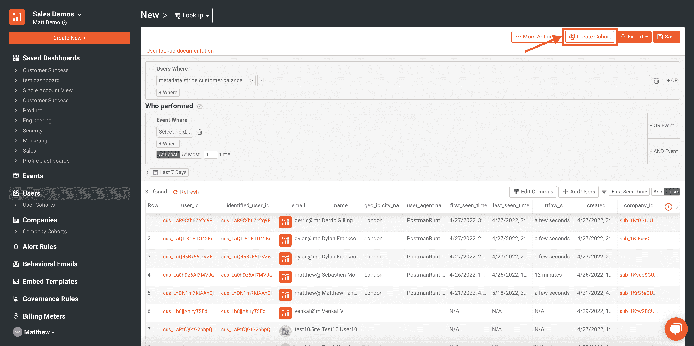

然后，您将看到一个模型，允许您命名群组(如果您愿意，还可以设置群组通知)。输入群组的名称，并点击模式右下角的**创建群组**按钮。

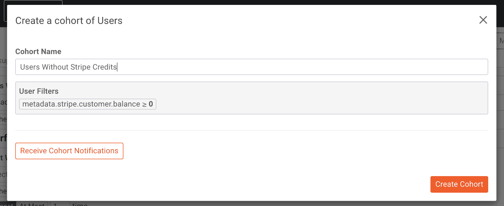

之后，系统会提示您使用新创建的群组。在模式的下一个屏幕上，选择**创建治理规则**。

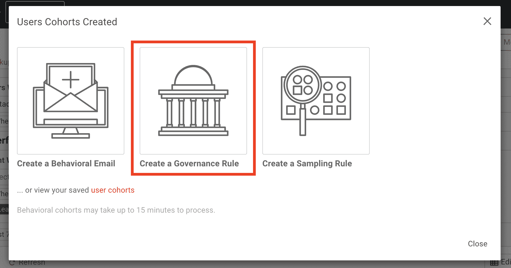

这将把您带到**治理规则**屏幕，您可以在这里创建规则。

*[利用 Moesif 将新用户集成到您的平台并快速解决问题。](https://www.moesif.com/solutions/customer-success?utm_campaign=Int-site&utm_source=blog&utm_medium=body-cta&utm_term=moesif-stripe-payg)T3】*

## 设置治理规则

对于治理规则，我们将看到我们新创建的群组已经添加到了 **Apply To Users** 字段下。我们还需要确保**阻止**复选框被选中，**覆盖响应状态**应该被设置为 **402 需要支付**，并且**覆盖响应主体**下拉列表应该被设置为**合并标签**，并且应该在文本输入中填充一条 JSON 错误消息。

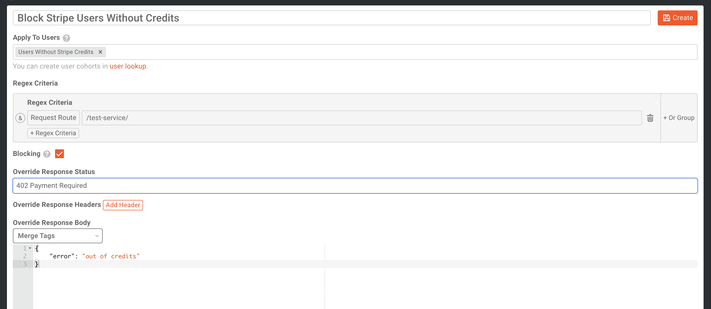

然后点击右上角的**创建**。

创建之后，您需要确保通过在上将规则切换到**来启用规则。**

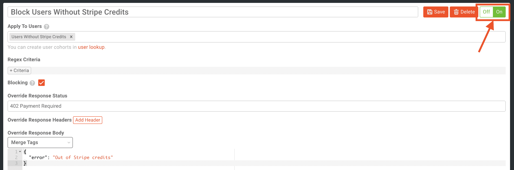

启用规则后，您需要点击屏幕右上角的**保存**。

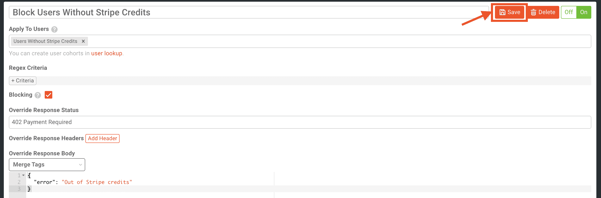

您的**治理规则**现在将被激活。

> 该规则可能需要几分钟才能生效。如果规则没有立即生效，给 Moesif 15 分钟来传播规则并使其生效。

## 设置行为电子邮件

为了主动让用户知道他们已经用完了信用，我们还将通过群组向他们发送一封行为电子邮件，这与治理规则的触发方式相同。

为此，我们将单击左侧导航中的**行为电子邮件**菜单项。然后我们将点击**创建模板**。

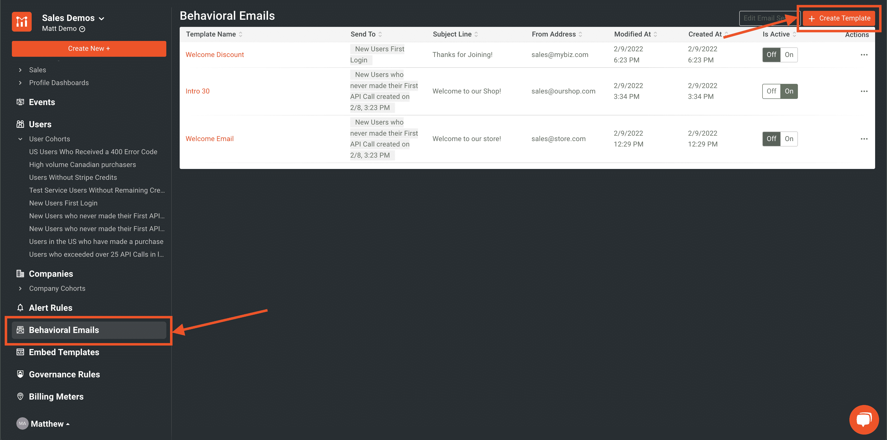

> 对于这个例子，我使用 Sendgrid 作为 SMTP 服务器。关于如何设置的更多说明，请查看我们的博客。您需要设置您的电子邮件服务器，然后才能发送电子邮件。

点击**创建模板**后，系统会提示您想要设置的电子邮件类型。Moesif 提供了许多不同的“预装”选项供您选择，但就我们今天的目的而言，我们将选择**空白**。点击此按钮，我们将进入电子邮件设计界面。

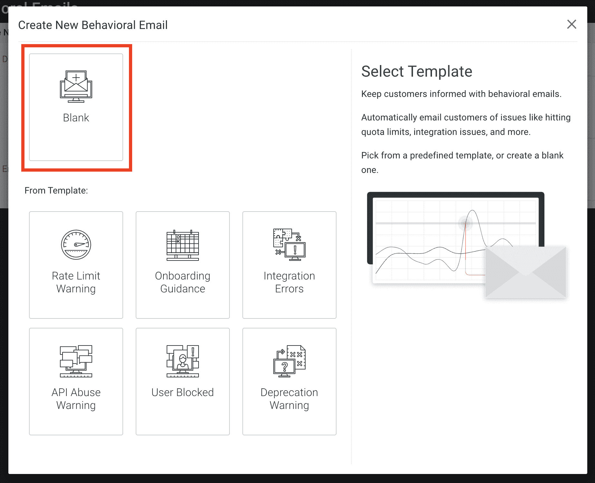

在电子邮件设计屏幕上，我们将:

*   命名我们的电子邮件
*   选择我们的团队来触发电子邮件(我们之前创建的那个)
*   添加我们的主题行
*   从地址添加我们的**，并且可选地，从名称**添加我们的
***   选中**循环工作流**的复选框*   将字段后符合重新注册条件的**设置为“1 小时”****

 **下面是配置完成后的外观示例。

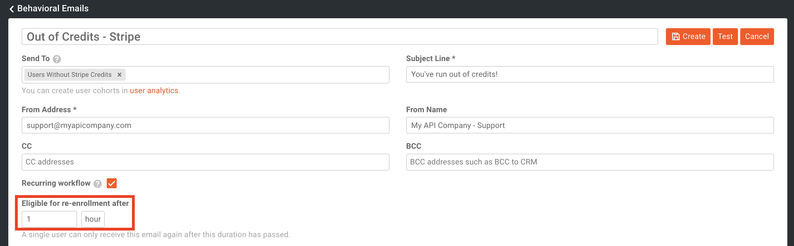

接下来我们将关注模板本身。我们将单击**添加行**按钮，开始向模板添加一些元素。

然后，我们将点击**添加内容**。

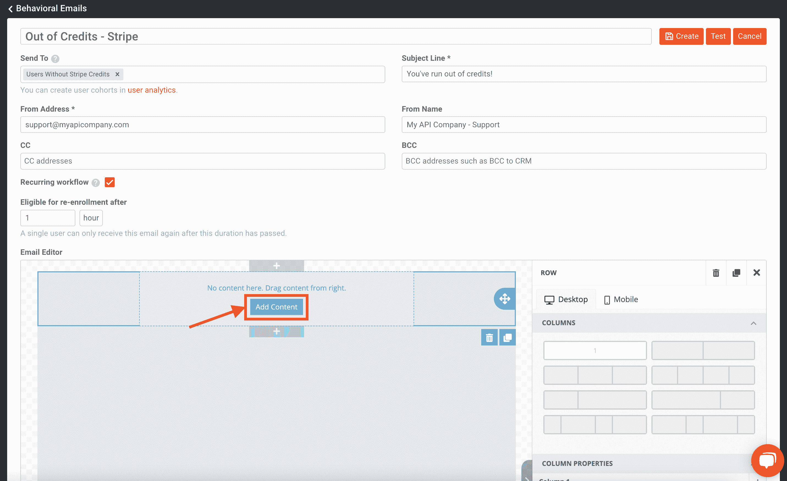

接下来，我们将从右侧菜单中拖放一个文本元素到模板上。

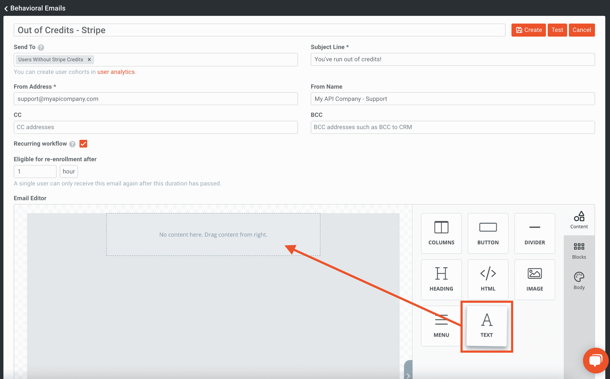

单击新添加的文本元素。我们将开始在其中输入我们的电子邮件内容。这样我们可以添加一个更加定制化的感觉，我们将在编辑器中点击**合并标签**，并选择**的名字**。

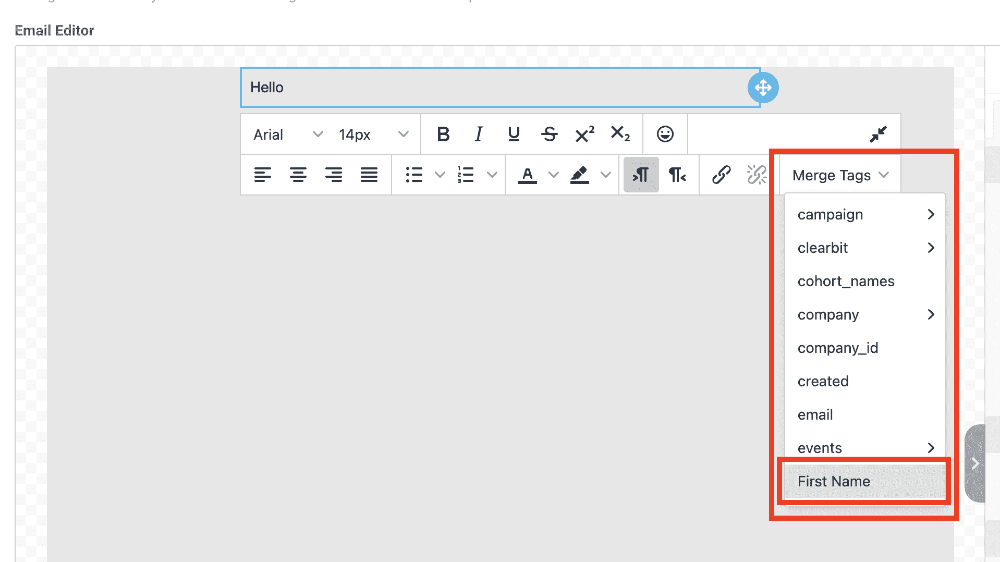

我们完成的电子邮件看起来将如下所示。然后，我们将单击 **Test** 向我们的帐户发送一封测试电子邮件，以验证电子邮件配置是否一切正常。最后，我们将点击**创建**来实际创建电子邮件。

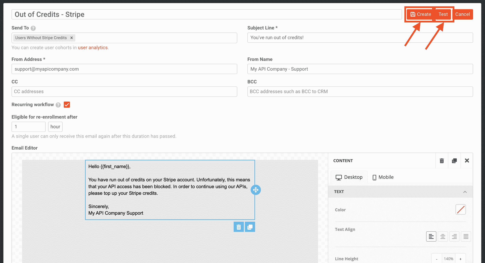

一旦你回到行为电子邮件菜单，你也要确保在**是活跃的**栏中的电子邮件是打开的。您可以使用滑块在状态之间切换。

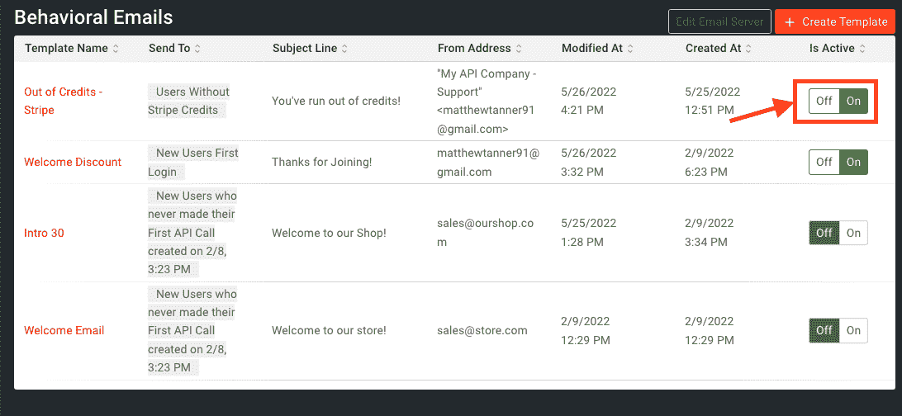

群组、治理规则和电子邮件现在都已经设置好了，可以进行测试了。

*[使用 Moesif 降低分析成本——零维护，不影响性能。](https://www.moesif.com/enterprise/api-analytics-infrastructure?utm_campaign=Int-site&utm_source=blog&utm_medium=body-cta&utm_term=moesif-stripe-payg)T3】*

## 测试设置

测试设置很容易做到。首先，我们将登录 Stripe，选择一个客户，并给他们一些积分。

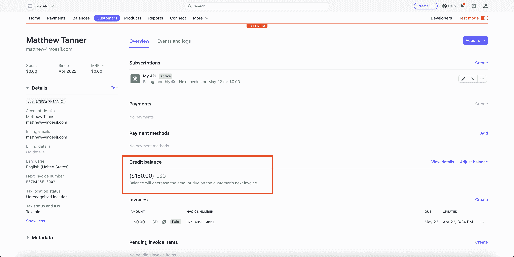

然后，我们可以为这个用户发送一个请求，并看到在 Postman 中返回一个 **200 OK** 响应。

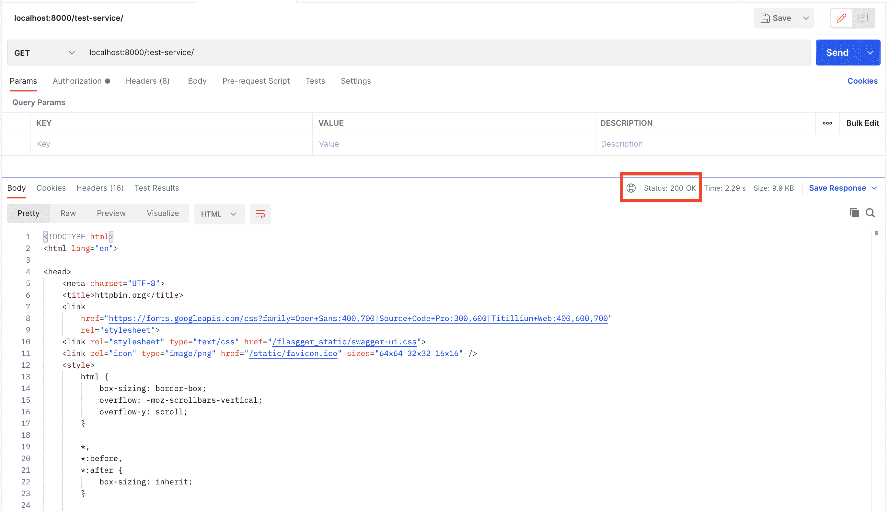

然后，我们将从该用户的 Stripe 中扣除点数，使他们的余额为 0 美元。

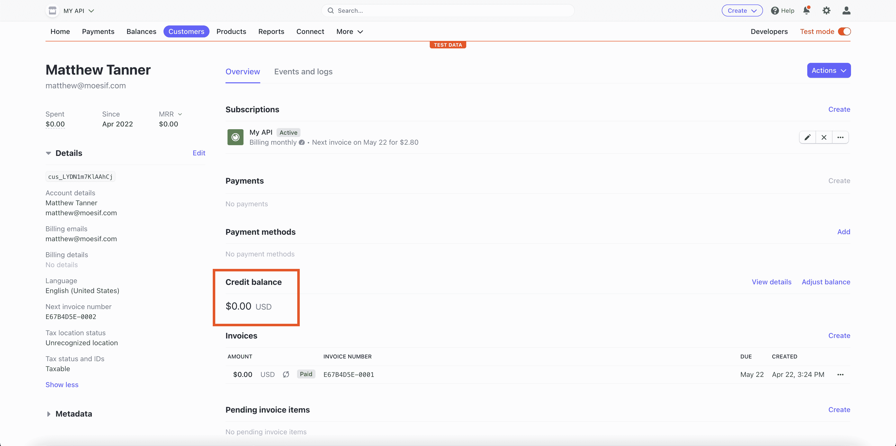

然后，用户将被添加到 Moesif 群组中。

> 值得注意的是，由于 Moesif 的工作方式，成员加入群组或从群组中移除可能需要几分钟时间。如果表格右侧有一个黄色警告标志，则用户尚未同步到群组中。如果是绿色支票，则用户已成功同步到群组。

然后，我们将再次发送一个用户没有信用余额的请求。然后，Moesif 将阻止该呼叫，并向用户返回一个 **402 付款要求**。

这将有效地阻止用户使用 API，直到他们将更多的信用添加到他们的 Stripe 帐户。

最后，用户还应该收到我们之前创建的“资金不足”电子邮件。会被接收到，看起来像这样:

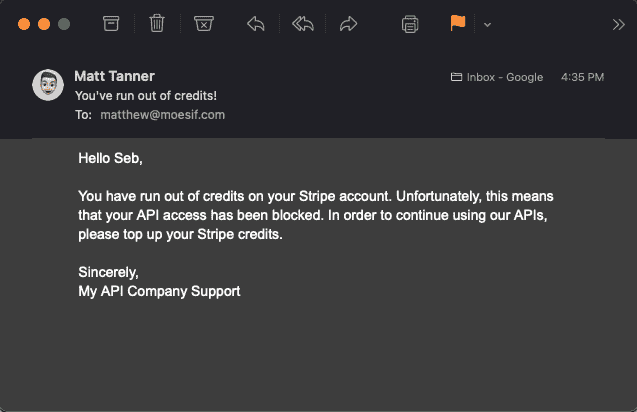

这样，我们就可以确认我们的 PAYG 货币化计划完全有效。现在，用户将被要求为他们的账户充值，以便使用 API，并且还会收到电子邮件通知他们。

当然，为了根据您组织的需求定制它，还需要考虑许多其他因素。您可以为您的治理规则设置一个最低信用阈值，其中用户必须拥有大于 10 美元的条带信用才能使用 API，或者类似的东西。您还可以在客户达到 0 余额之前通知他们，以确保他们不会暂停使用并导致其应用程序的服务中断。

## 试试吧！

想为您的 API 和应用尝试 PAYG 计费或后付费计费吗？[立即注册](https://www.moesif.com/signup?utm_campaign=Int-site&utm_source=blog&utm_medium=body-cta&utm_term=moesif-stripe-payg)moes if，开始使用[计费表](https://www.moesif.com/docs/metered-billing/?utm_campaign=Int-site&utm_source=blog&utm_medium=body-cta&utm_term=moesif-stripe-payg)、[行为电子邮件](https://www.moesif.com/docs/behavioral-emails/?utm_campaign=Int-site&utm_source=blog&utm_medium=body-cta&utm_term=moesif-stripe-payg)、[治理规则](https://www.moesif.com/docs/api-governance-rules/?utm_campaign=Int-site&utm_source=blog&utm_medium=body-cta&utm_term=moesif-stripe-payg)和[强大的分析](https://www.moesif.com/docs/api-analytics/?utm_campaign=Int-site&utm_source=blog&utm_medium=body-cta&utm_term=moesif-stripe-payg)，开箱即用。Moesif 是满足您所有货币化需求的“一站式商店”，我们支持越来越多的支付平台，包括 [Stripe](https://stripe.com/) 、 [Recurly](https://recurly.com/) 和 [Chargebee](https://www.chargebee.com/) 。**