# 使用 Moesif 的实时事件日志来过滤和检查 API 调用和事件

> 原文：<https://www.moesif.com/blog/product-management/moesif-product/Using-Moesifs-Live-Event-Log-to-Filter-and-Inspect-API-Calls-and-Events/>

如您所知，事件日志是操作系统和其他软件中的常见功能，用于跟踪系统和应用程序错误。当你有 API 流量要跟踪，或者有前端动作要观察的时候，使用 Moesif 的 [**实时事件日志**](https://www.moesif.com/docs/api-analytics/event-stream/?utm_campaign=Int-site&utm_source=blog&utm_medium=body-cta&utm_content=live-event-log-filter) 是一个简单的过滤和查找你需要的数据的方法。在本文中，我们将回顾一下**实时事件日志**的基础知识，包括如何过滤您想要的数据，您可以对日志执行的不同操作，以及如何使用它们进行故障排除和调试。

## 什么是实时事件日志？

Moesif 中的**实时事件日志**是所有应用程序或服务中发生的 API 事件和动作的实时运行记录。**实时事件日志**允许您过滤收到的 API 调用和动作中的特定属性。**实时事件日志**为您提供了一种简单易用的方式，让您以用户为中心，深入了解您平台上的 API 使用情况和用户行为。

## 为什么要使用实时事件日志？

**实时事件日志**是一个非常有用的工具，可以实时跟踪网站或应用程序上发生的事情。使用**实时事件日志**可以帮助您排除错误，跟踪用户活动，并深入了解您的网站或应用程序的使用情况。

在查看传统日志时，搜索和过滤可能非常困难。Moesif 轻松支持极其简单或复杂的查询。Moesif 允许您基于日志中的数据构建查询，这样就不会有猜测。例如，如果您在一个端点上进行过滤，Moesif 将使用当前数据中包含的端点预先填充过滤器下拉列表。

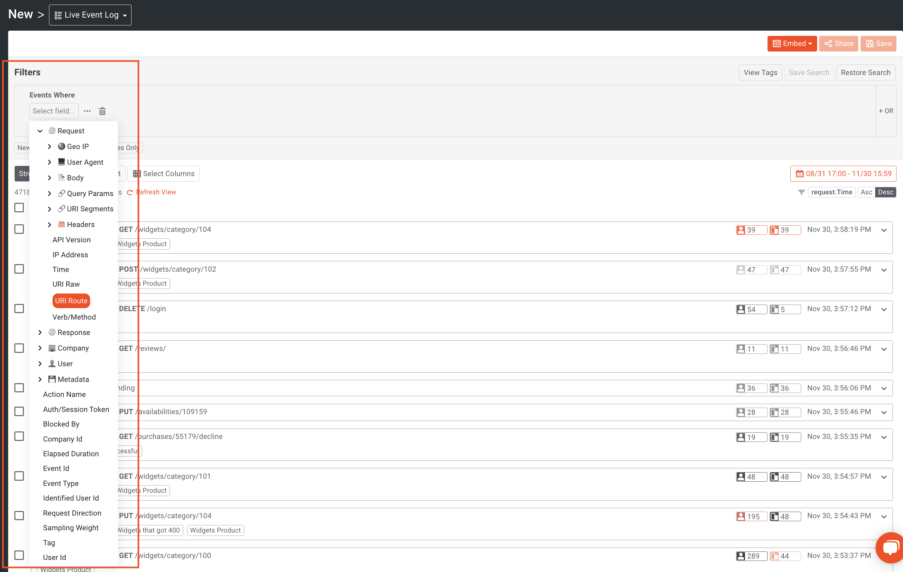

Moesif 还支持主体和标题分析，这意味着您可以基于特定的主体字段及其内容使用 Moesif 过滤器。这种粒度级别是 Moesif 区别于其他 API 和产品分析平台的部分原因。

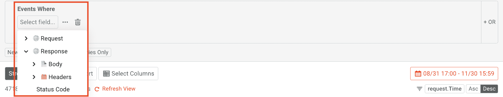

## 使用实时事件日志

既然你已经知道了 **Live Event Log** 是什么以及它的作用，那么让我们来看看如何在 Moesif 中使用它。虽然这不是一个你可以创建和使用**实时事件日志**的详尽列表，我们将向你展示一些创建和使用它们的常用方法。

要进入**实时事件日志**屏幕，点击新建按钮并选择**实时事件日志**。

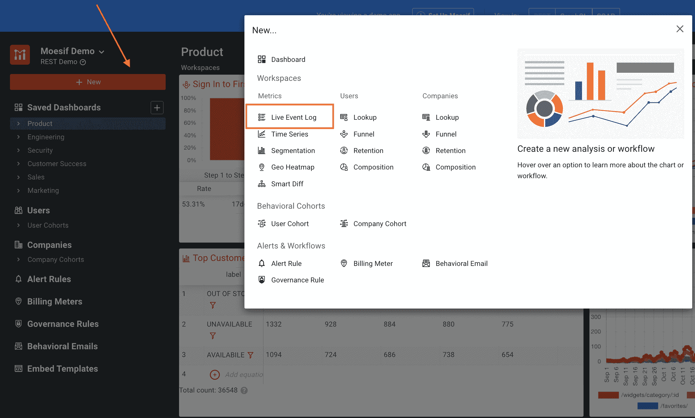

### 如何创建过滤器

创建过滤器是查看**实时事件日志**屏幕中事件的最佳方式。一旦你进入**实时事件日志**屏幕，过滤器输入就会出现在顶部。

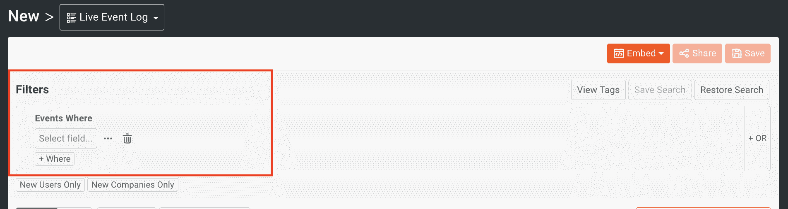

您可以通过各种 API 属性进行过滤，如 URI 路由、查询参数、HTTP 头和主体字段。您还可以根据事件是 API 调用还是操作进行过滤。动作在您的用户界面中显示客户的活动，如“登录”或“浏览指南”。

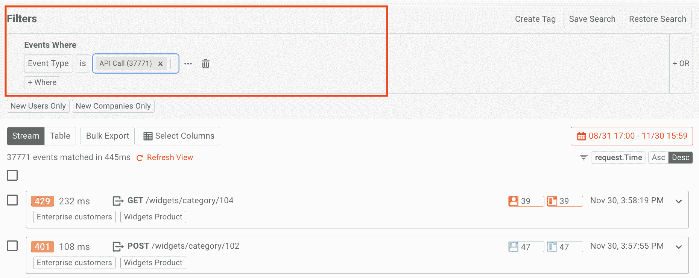

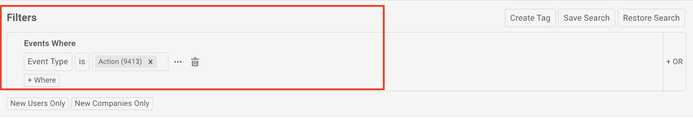

**实时活动日志**还允许您仅显示新用户和公司的活动。这可以通过使用“仅新用户”和“仅新公司”过滤器按钮来完成。

根据您要查找的数据，过滤器可能非常简单，也可能非常复杂。有关如何构建过滤器的更多信息，请查看我们的文档。

### 显示事件数据

您还可以自定义查看**实时事件日志**的方式。您可以查看来自**现场事件日志**的数据，作为**流**或**表**。**流**视图将每个 API 调用或动作显示为可点击的元素。

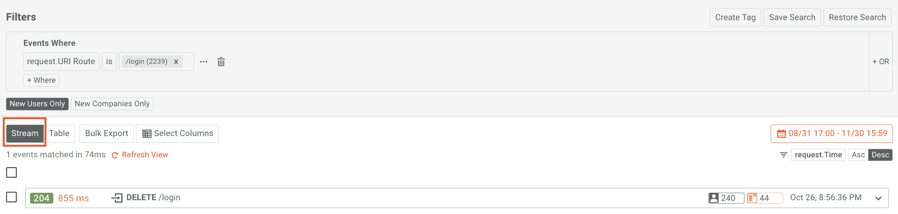

**表**视图以类似于电子表格的方式显示事件。

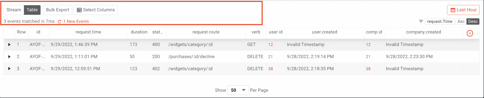

### 导出数据

Moesif 提供的其他功能包括通过浏览器下载事件或导出事件以在 Postman 中运行的能力。

要导出事件，选择一些事件并点击**批量导出**按钮。

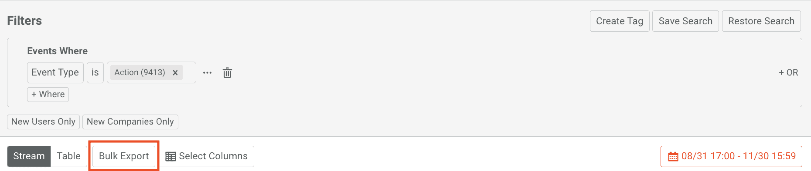

然后，您将选择是否希望输出为 JSON、CSV 或 Parquet 格式以及要发送的电子邮件。一旦表格完成，点击**开始导出**按钮。

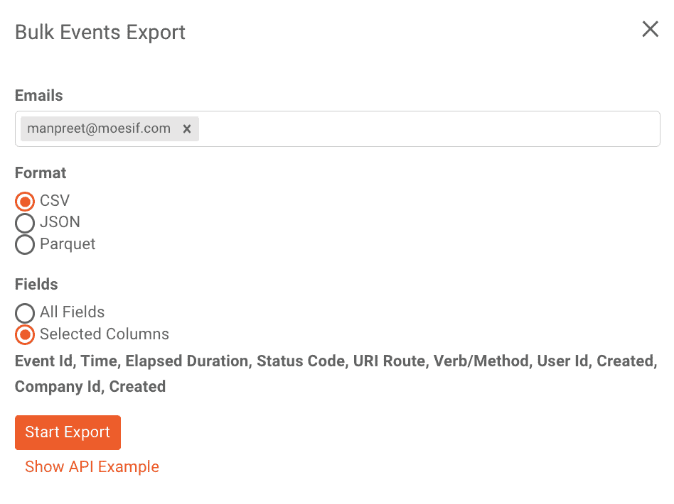

导出完成后，您将收到一封电子邮件，其中包含上一个模式中指定的电子邮件的下载链接。

对于 Postman，只需选择想要导出的 API 调用，然后单击屏幕顶部的 **Run in Postman** 按钮。

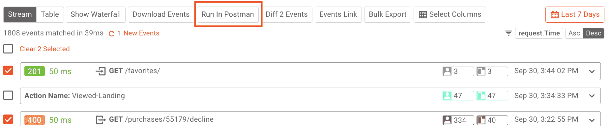

然后会提示你**下载邮差合集**。收藏将被保存，然后可以上传到邮递员。更多细节，请查看[我们的文档](https://www.moesif.com/docs/api-analytics/run-in-postman/?utm_campaign=Int-site&utm_source=blog&utm_medium=body-cta&utm_content=live-event-log-filter)，它显示了一步一步的程序。

### 使用 Diff 2 事件比较事件

有时比较两个不同调用的请求和响应是有意义的。当试图调试 API 调用中的问题时，这是一个常见的场景。您可能想要检查成功的调用和导致错误的调用之间的区别。要在 Moesif 中做到这一点，可以使用 **Diff 2 Events** 函数来比较两个 API 调用。

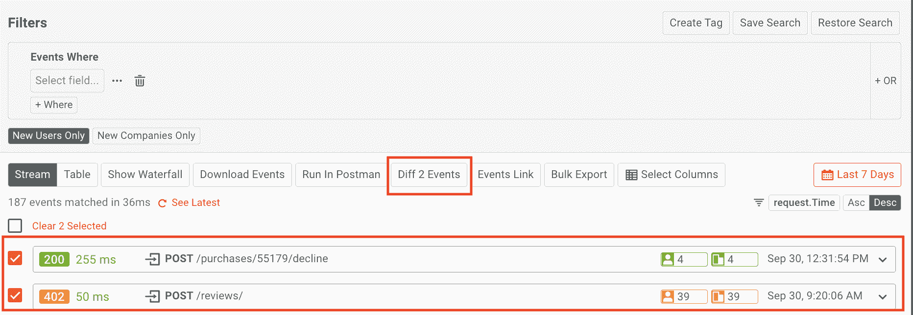

一旦选择了两个调用并点击了 **Diff 2 Events** 按钮，您将能够看到红色突出显示的文本显示已移除的更改，而绿色显示已实施的更改。

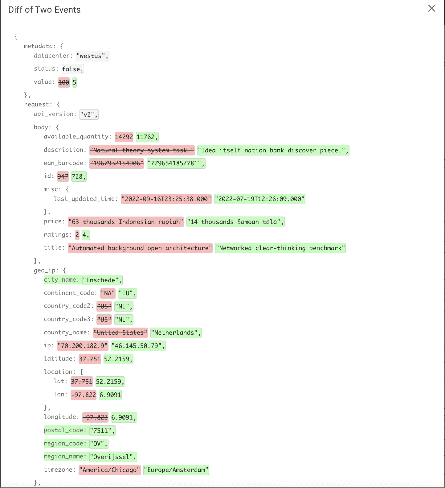

使用这一功能可以省去寻找差异的手工工作，并以易读的方式轻松地向用户展示。

### 将您的搜索保存到仪表板

一旦你可以创建一个你喜欢的**实时事件日志**过滤器，你可能想把它添加到 Moesif 的仪表板上。Moesif 让您可以选择保存并与您的团队成员或私下分享您创建的日志。要将**现场事件日志**保存到 Moesif 中的仪表板，点击**保存**按钮。

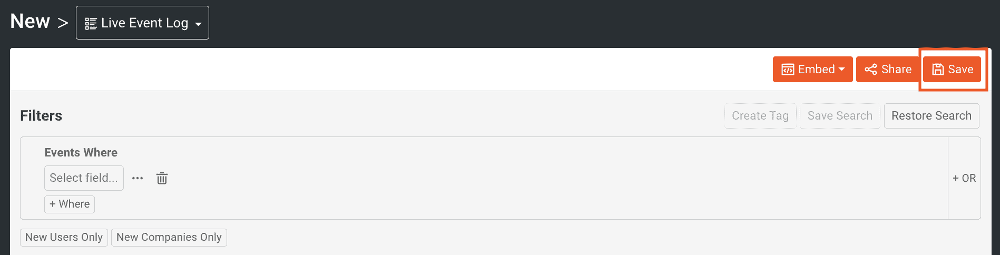

在出现的模式中，命名您的新工作区(您刚刚创建的**实时事件日志**)，选择您希望该工作区是私有的还是为您的团队所有，并选择您希望将其添加到的仪表板。

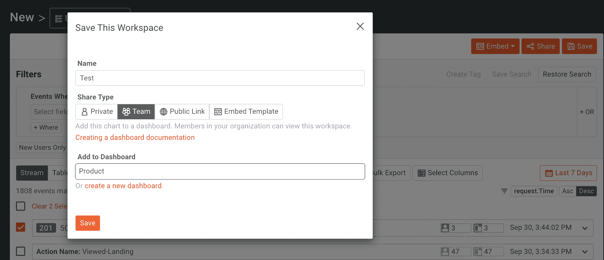

最后，单击模式底部的 save 按钮，将工作区保存到仪表板中。

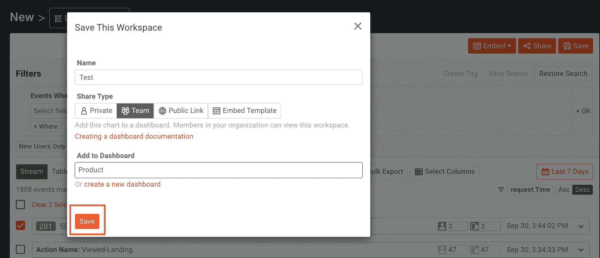

### 将实时事件日志导出为公共链接或嵌入模板

如果您想将您的**实时活动日志**分享给无权访问 Moesif 的用户，包括您的客户，您可以使用公共链接或嵌入模板。

一个**公共链接**可以用于安全地与外部共享指标，或者在 iFrame 中静态嵌入图表。公共链接有一个不能更改的静态过滤器。要创建一个，点击**实时活动日志**屏幕顶部的**分享**按钮。

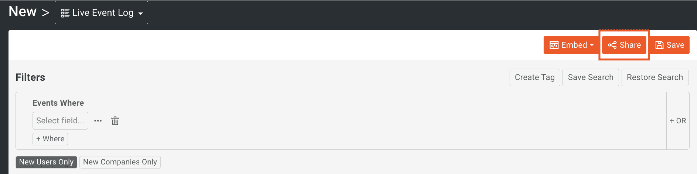

在出现的模式中，确保选择了**公共链接**。

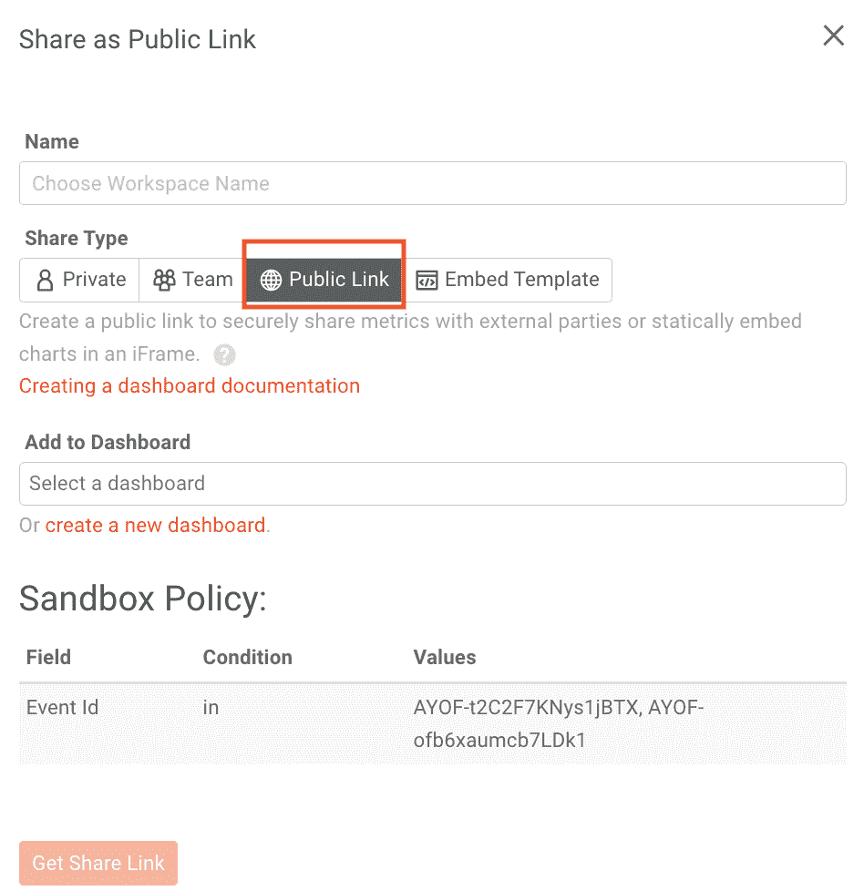

从模式中获取链接或静态嵌入代码。

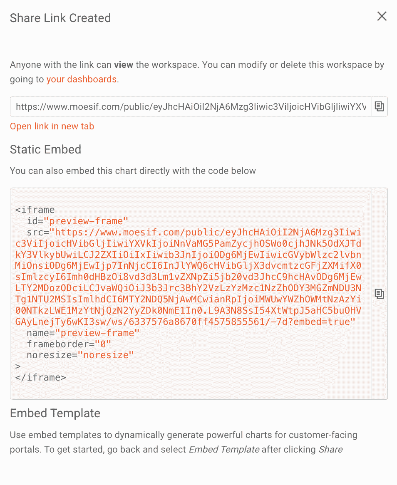

如果你想让用户调整一些过滤器，你可以使用一个**嵌入模板**。此功能允许您在面向客户的应用程序中嵌入动态图表。可以创建动态字段(如经过身份验证的用户)来限制数据访问。要创建模板，点击**实时事件日志**屏幕顶部的**嵌入**按钮，并选择**创建模板**。

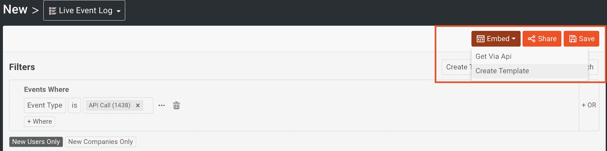

在这里你可以添加你的**沙盒策略**，然后点击**获得嵌入代码**。

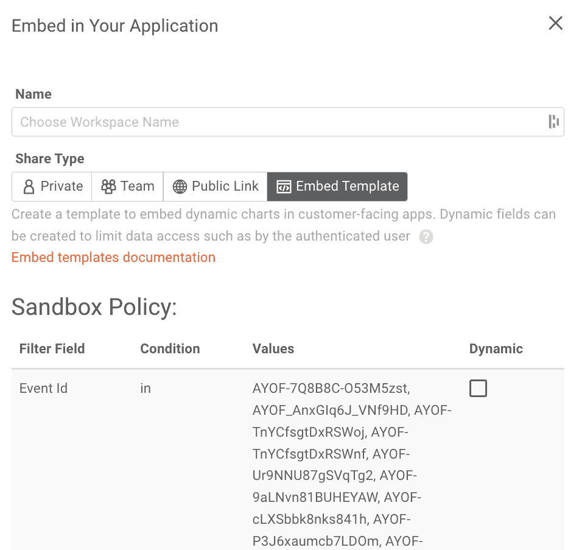

现在，您可以将生成的代码嵌入到您的应用程序中。

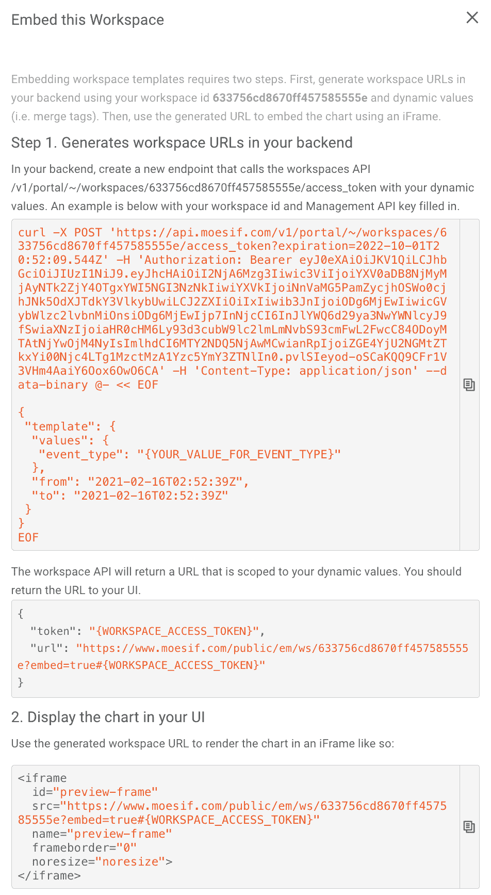

## 尝试一下

Moesif 的**实时事件日志**对企业和开发者来说都是非常有用的工具。我们希望这份指南能让你更好地理解 Moesif 的**实时事件日志**是如何工作的，以及它的一些最有用的特性。无论您只是想要一种简单的方法来分析平台上发生的每个事件，还是试图对您的应用程序和 API 进行故障排除，**实时事件日志**都是不可或缺的工具。要亲自体验**现场活动日志**，请[登录](https://www.moesif.com/wrap?utm_campaign=Int-site&utm_source=blog&utm_medium=body-cta&utm_content=live-event-log-filter)至 Moesif 或[立即注册](https://www.moesif.com/wrap?onboard=true&utm_campaign=Int-site&utm_source=blog&utm_medium=body-cta&utm_content=live-event-log-filter)开始体验。