# 使用时序图探索 API 的使用

> 原文：<https://www.moesif.com/blog/api-product-management/api-analytics/Using-Time-Series-Charts-to-Explore-API-Usage/>

深入研究 API 和产品分析的一个主要原因是为了能够轻松识别数据中的趋势。当然，在查看像原始 API 调用日志这样的东西时，趋势可能很难看到，但是在查看旨在方便您可视化趋势的图表时，趋势可能会容易得多。进入**时间序列**图。

**时间序列**图着眼于特定时间间隔内的趋势。你可能在日常生活中熟悉这些类型的图表。举例来说，显示标准普尔 500 指数每月平均回报率的图表通常显示在时间序列图中。想象一下，如果您可以用这种类型的图表来显示 API 指标，如调用量、平均延迟，甚至是更以业务为中心的指标，如每天或每周新加入的用户数量。有了 Moesif **时间序列**功能，你就可以做到这一点。

## 什么是时间序列？

在 API 和产品分析环境中，**时间序列**分析允许您查看特定时间段内 API 流量的总体趋势。一般来说，时序图是一种显示数据集的方式，该数据集测量一段时间内的一些量。**时间序列**图表用于统计学、信号处理、计量经济学、数学建模以及许多其他用途。

## 使用时间序列的好处

使用时间序列报告来显示 API 使用情况有很多好处。时间序列数据的好处是随着时间的推移易于收集和跟踪。使用**时间序列**图表是直观识别趋势和轻松比较历史数据的好方法。另一个好处是，**时间序列**图表还可以帮助公司识别未来可能的趋势，因为它可以直观地预测趋势的走向。

在 API 和产品分析的背景下，**时间序列**图表也是向那些不太懂技术的人显示数据的一种简单方式。不像其他类型的报告可能需要一些技术知识来解读，时间序列报告的视觉特性使其易于理解。

**可以为不同的时间段创建时间序列**，例如每小时、每天、每周、每月或每年。这允许您比较不同时间段的使用情况。这可以帮助开发人员规划未来的流量，并优化他们的 API 性能。这些信息可用于改进 API 设计、优化性能和解决问题。此外，时间序列可用于跟踪客户满意度或监控 SLA(服务水平协议)。

## 如何创建时间序列图表

用 Moesif 创建一个**时间序列**图表极其简单。第一步是导航到**时间序列**屏幕，这可以通过点击**新**按钮并选择**指标**选项下的**时间序列**来完成。

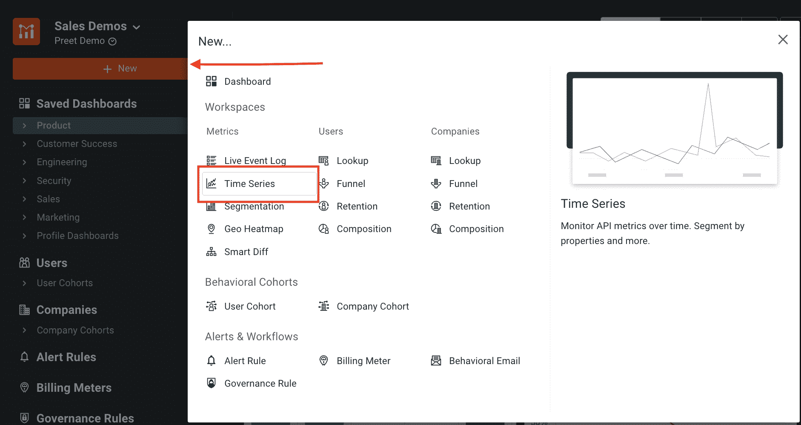

一旦你进入**时间序列**屏幕，你就可以根据你想要在**时间序列**图表中追踪的数据建立过滤器。Moesif 允许用户通过解析您的数据轻松构建过滤器，从而提高效率。

例如，您可能希望显示**时间序列**数据，以显示用户遇到的 **404 -未找到**错误的趋势。为此，您可以为`response.Status Code = 404 Not Found`添加一个过滤器。下面是输入到 Moesif 后的样子。

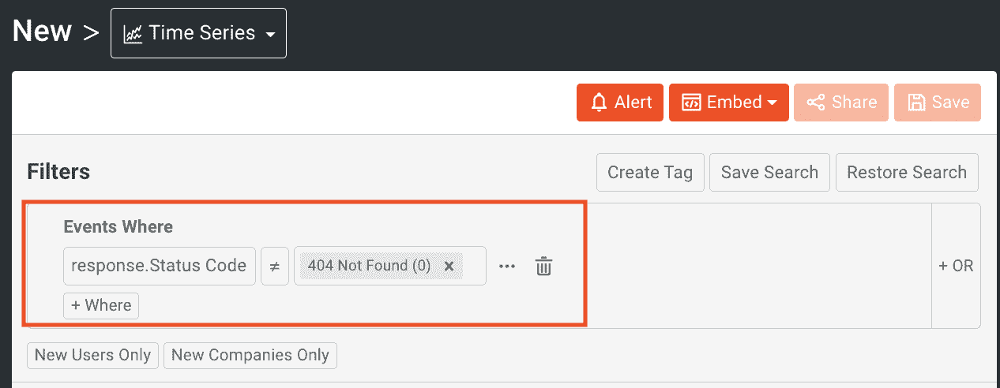

如果您想在事件标准中更加具体，您还可以选择通过选择 **+ Where** 按钮来过滤多个事件，并添加额外的标准。

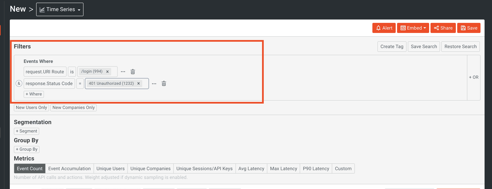

结果将显示如下，使用条形图样式。Moesif 能够适应几乎无限复杂的过滤，因为您可以添加的额外的 **where** 子句的数量没有限制。

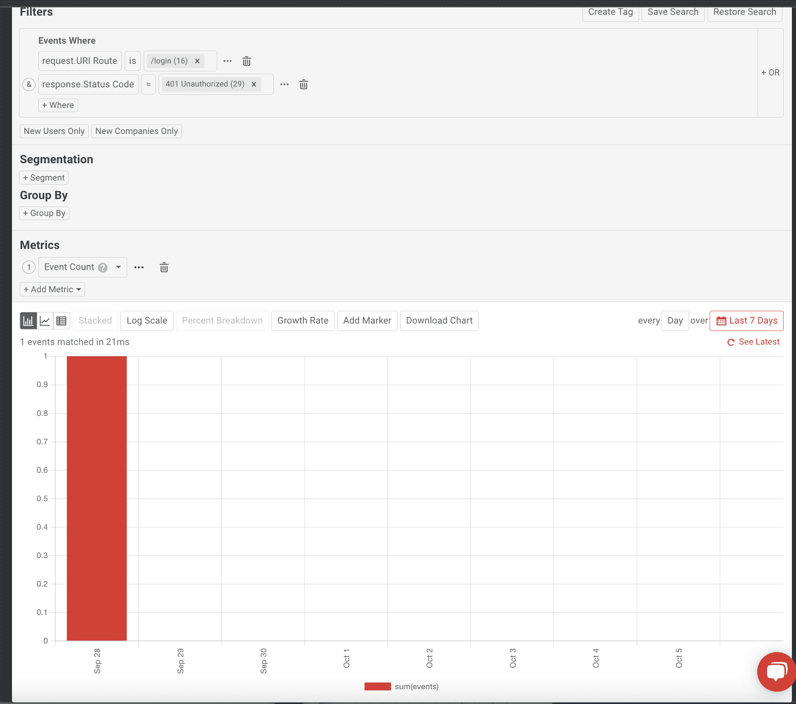

> 如果您在实时 API 日志中过滤事件，相同的过滤器将用于过滤时间序列图表。更多细节，请查看我们的文档。

## 时间间隔如何与时间序列图一起工作

Moesif 将通过匹配时间间隔的底部和顶部来对齐时间间隔。你可以通过转到应用和团队设置来更改你的全球时区。默认情况下，浏览器自己的时间被用作时区，但您可以根据需要对此进行任何更改。Moesif 始终与日历时间间隔保持一致，因此最后一个时间间隔可能不会被完整报告。例如，如果当前时间是下午 5:55，并且您选择了“每日”时间间隔，则最后一个时间间隔将只包括从上午 12:00 到下午 5:55 的数据。这种不完整的时间间隔通常会在**时间序列**上显示为虚线，表示该时间间隔没有完整报告。

## 添加分组以获得更深入的见解

Moesif **时间序列**图表也支持 **Group By** 功能。使用 **Group By** 允许您根据特定标准对数据进行分组。这可能是按照`Response.StatusCode`、`Company Domain`、`UserId`对数据进行分组的方式，甚至是类似于`Initial UTM Source`的方式。下面的图表显示了一个**时间序列**，它由`Response.StatusCode`为每个对 **/login** 端点的 API 调用进行分组。这可以帮助用户看到特定响应的趋势，并帮助团队了解如果趋势是负面的，例如错误状态代码的高发生率，如何潜在地解决问题。

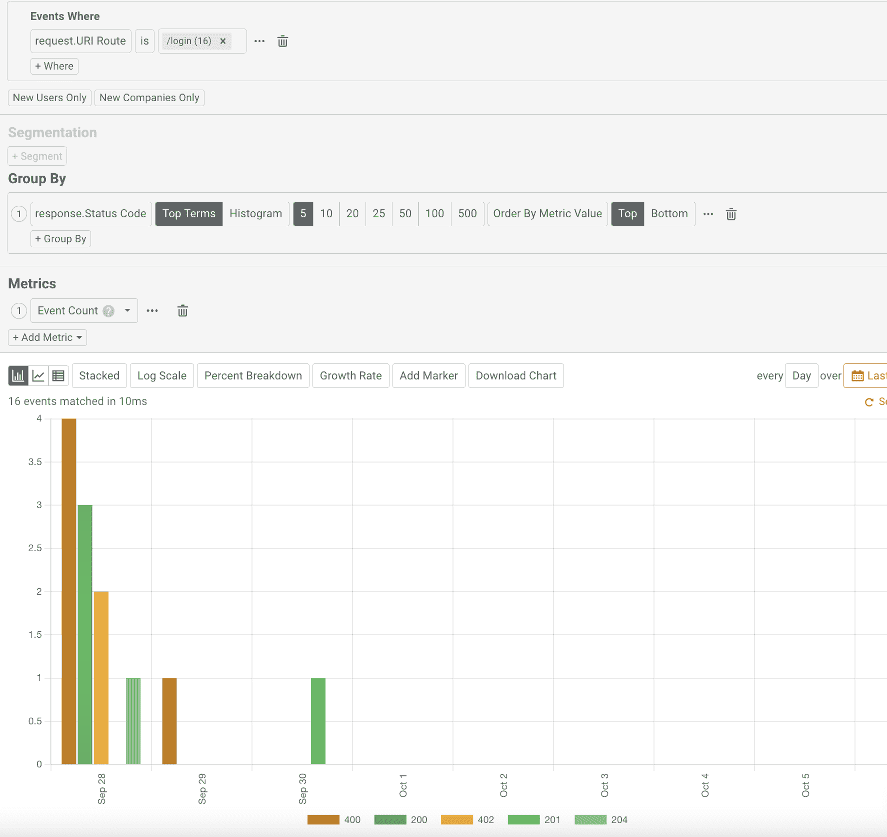

如果图表上的线条太多且变得拥挤，您可以在图表下方的图例中选择一个时间序列分组指标的名称，以显示或隐藏整个线条。当在**时间序列**图表中绘制了大量的数据和线条时，这将非常有用。

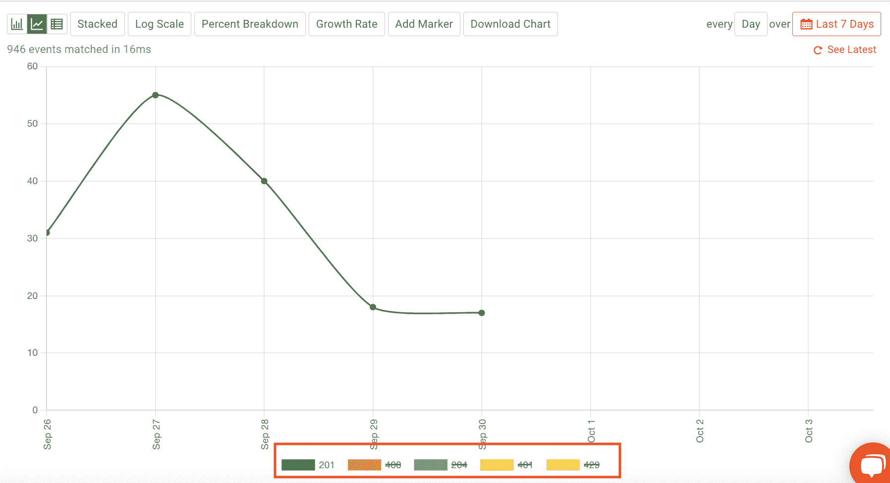

## 如何在时序图中使用 API 指标

除了`event count`之外，您还可以绘制其他指标。您可以从预定义的指标中进行选择，也可以根据自己的数据需求创建自定义指标。有多种选项可供选择:

*   事件累积
*   唯一用户
*   独特的公司
*   唯一会话/API 密钥
*   平均延迟
*   最大延迟
*   P90 潜伏期
*   请求人数
*   死亡人数
*   总计请求内容-长度
*   自定义指标

数值型或有日期的字段将显示数据字段的最小值、最大值和平均值以及不同的值。字符串类型的字段将只显示不同的值。

例如，添加自定义指标允许您在图表上使用多个指标。这可以使用**指标**下拉菜单中的自定义指标选项来完成。此外，您可以通过再次单击按钮 **+ Add Metric** 在图表上添加多个指标。

## 如何更改图表样式

**时间序列**图表可以使用三种不同的样式呈现，条形、线形或表格。

点击**时间序列**的左上方，获得条形图、折线图或表格视图。

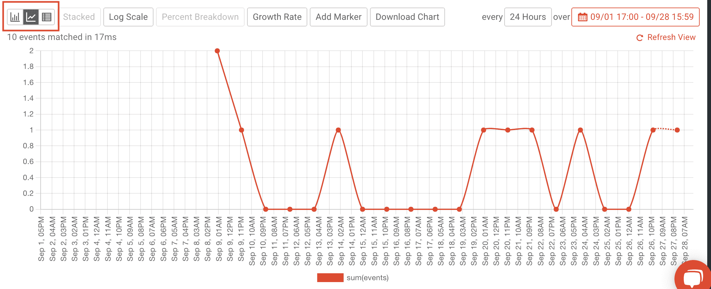

您还可以使用以下选项查看您的数据:日志标度(Log Scale)、**、【百分比分解】、**、**和**添加标记(Add Marker)**。**

**百分比分解**绘制每组的计算值与每个区间所有组的总和。**增长率**从第二个间隔开始，绘制与之前间隔相比的计算值。**添加标记**允许您通过添加线条与图形进行交互。

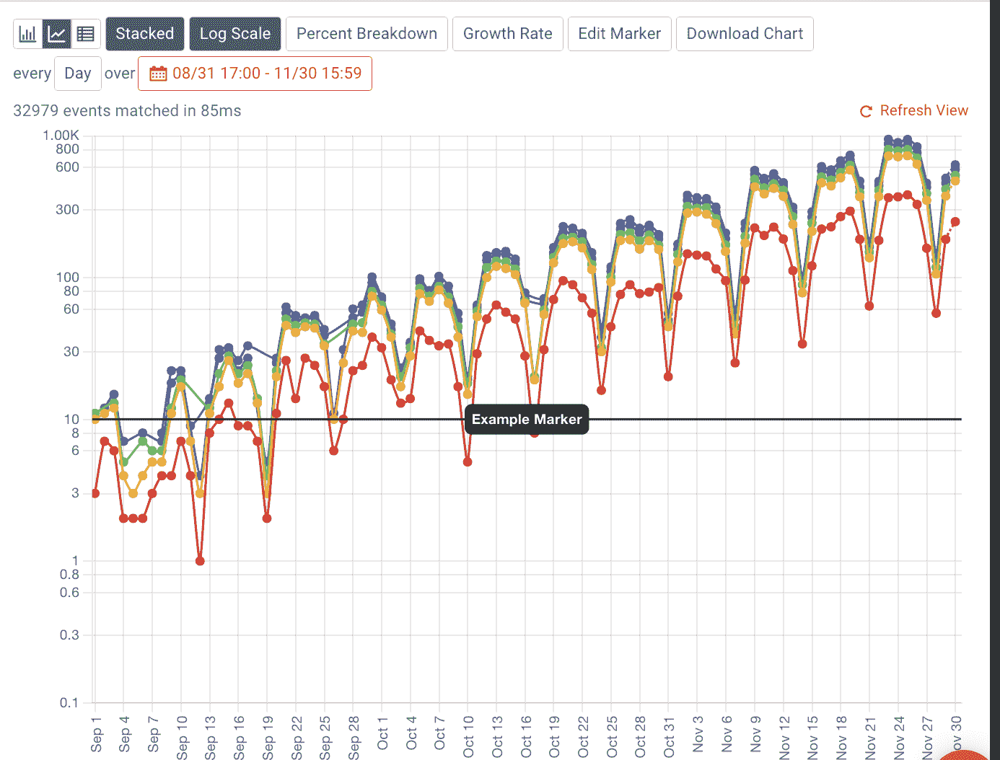

## 保存您的图表

### 保存到 CSV

如果您只是想提取绘制的数据，Moesif 提供了通过 CSV 文件下载当前事件的选项。

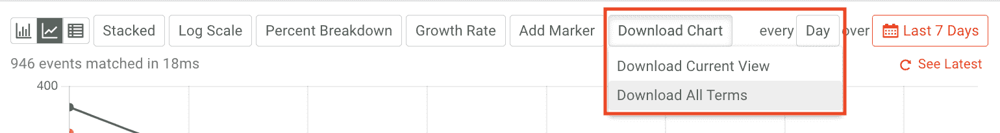 \

> 如果您正在下载所有术语，我们建议使用**批量导出**功能来获取这些数据。

### 将作品保存为公共链接或嵌入模板

Moesif 允许你以多种方式保存你的工作。

*   私人的
*   组
*   公共链接
*   嵌入模板

要创建一个，点击**时间序列**仪表板顶部的共享按钮。

要创建私有工作空间，在将出现的模式中确保选择了**私有**。然后，您可以命名您的新工作区，并选择您想要将它添加到的仪表板。最后，点击模式左下方的**保存**按钮，将工作区保存到所选仪表板。

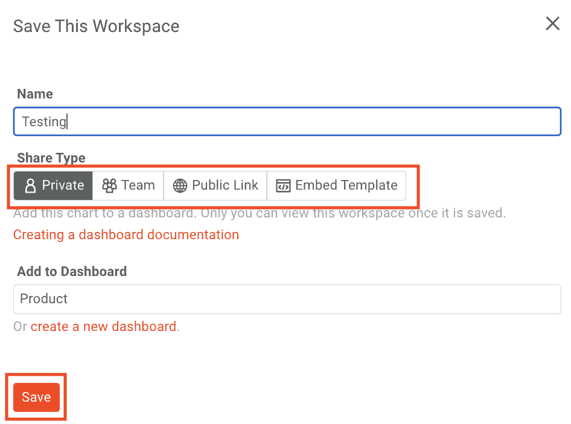

要创建一个与您的团队共享的工作区，步骤与创建一个**私有**仪表板非常相似。确保选择了**团队**，命名您的工作区，并将其添加到所需的仪表板中。确保点击**保存**将您的工作区保存到仪表板。

#### 公共链接

**公共链接**可用于安全共享指标。一个**公共链接**允许你在 iFrame 中嵌入图表。要创建一个，点击**时间序列**日志屏幕顶部的**分享**按钮。

点击**获取共享链接**生成链接，嵌入到你需要的地方。

#### 嵌入模板

使用嵌入式模板，您可以将动态图表嵌入到可定制的布局中。如果是更复杂的数据可视化，**动态字段**将允许您将数据限制在您授权的范围内。

要创建模板并将其嵌入到应用程序中，点击**时间序列**屏幕顶部的**嵌入**按钮，然后选择**创建模板**。

默认情况下，标题和正文是私有的，但是如果您需要基于这些字段进行过滤，您可以更改设置。值得注意的是，所有使用该模板的客户都会看到应用于数据的相同过滤器。

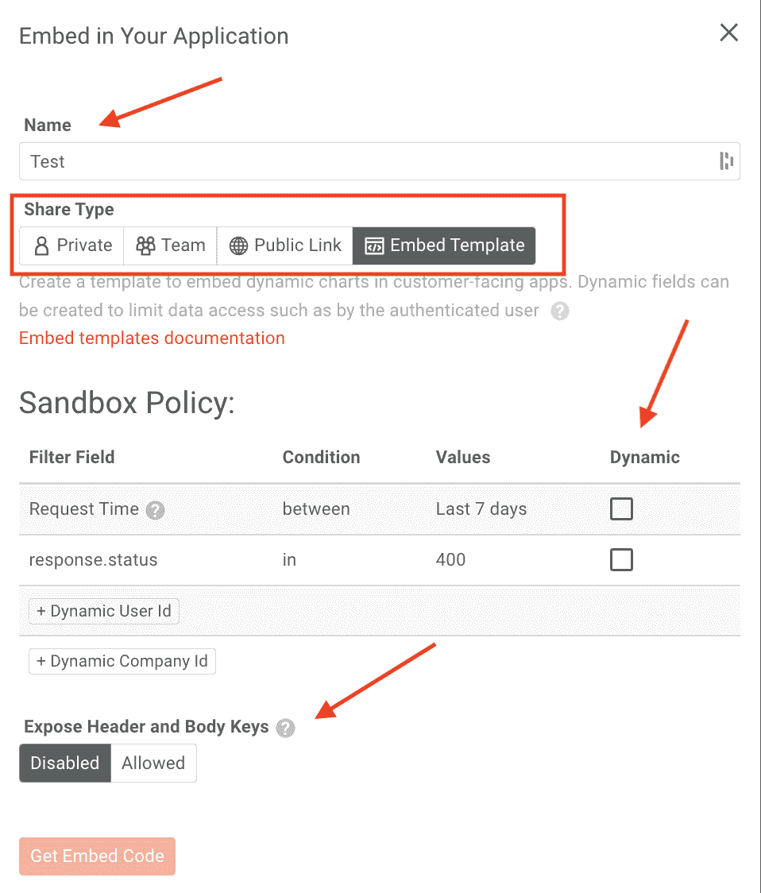

## 通过 API 访问

借助嵌入式模板，您可以为客户定制应用程序。例如，您可以创建一个按钮，通过在动态字段中输入数据来生成图表。

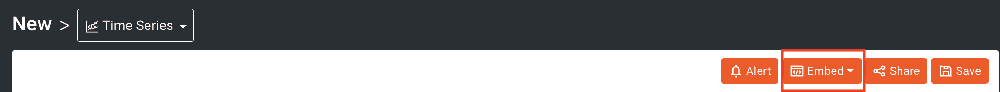

通过使用 read:events 范围生成管理 API 键，您可以获得以下数据，并订阅管理 API。在下面的命令中替换 YOUR_MANAGEMENT_API_KEY 并执行。

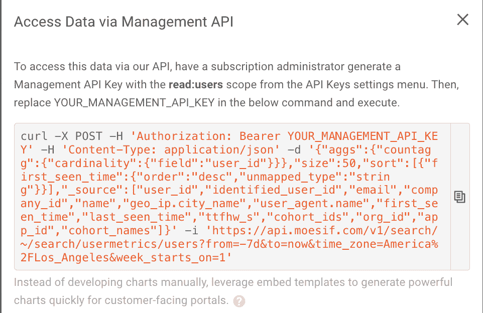

> 通过 API 访问数据可以允许更复杂的定制。如果复杂的定制不是你所追求的，最简单的方法将是利用**嵌入式模板**来代替。

## 创建警报

对于希望监控并主动采取措施让客户满意的用户来说，警报规则是一项重要功能。例如，您可能希望在大量客户的流量减少或延迟增加时收到警报。您可以使用警报规则来监控您创建的 API。此处为预警[的单据](https://www.moesif.com/docs/api-monitoring/?utm_campaign=Int-site&utm_source=blog&utm_medium=body-cta&utm_content=time-series-explore-usage)

导航至**时间序列**屏幕右上角的警报。

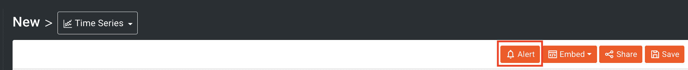

您应用的过滤器将在屏幕右侧的警报选项卡中弹出。

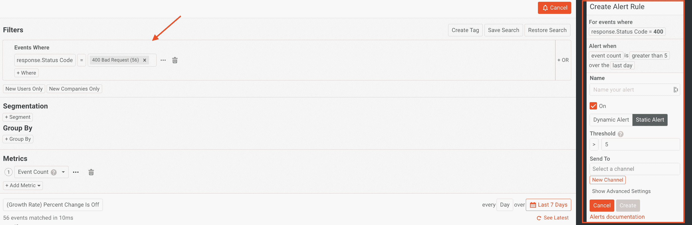

Moesif 为您提供了创建动态警报或静态警报的选项。动态警报寻找与 API 使用相关的峰值和趋势，而不是寻找预先确定的阈值。

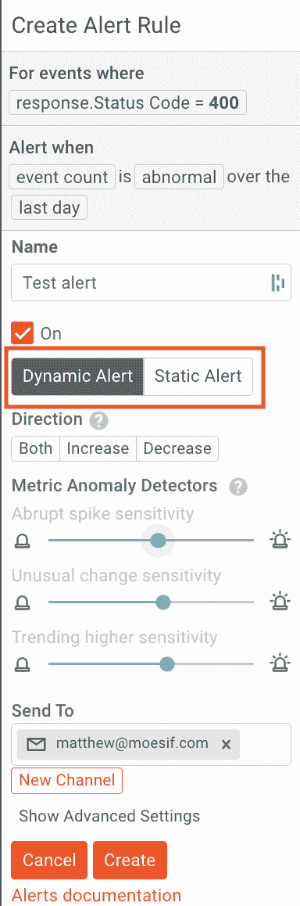

静态警报允许您在端点达到每小时 1，000 次呼叫时接收通知。当这种情况发生时，通知将被发送到预定的通道。

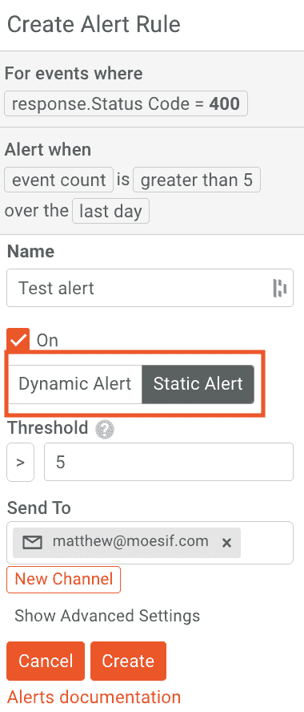

## 设置您的新渠道模式

如果 Moesif 检测到一个潜在的问题，它会通过电子邮件或您配置的任何应用程序通知您。如果您想为警报配置一个新的目标，您可以通过添加另一个通道来完成。要添加新频道，请点击警报面板上的**新频道**。

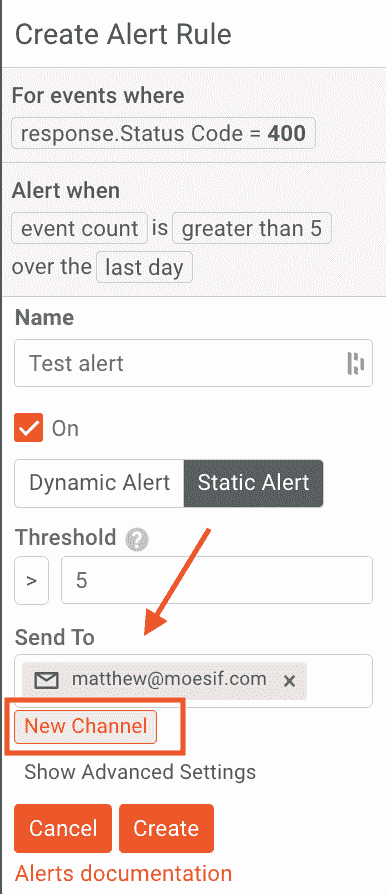

然后填写字段并选择您希望将警报发送到哪个频道。最后，点击**保存**保存详细信息并创建频道。

新创建的频道可以添加为新的和现有警报的频道。

## 试试吧！

为了亲自试用**时间序列**功能，[今天就登录](https://www.moesif.com/wrap?utm_campaign=Int-site&utm_source=blog&utm_medium=body-cta&utm_content=moesif-for-api-usage)或[注册](https://www.moesif.com/signup?utm_campaign=Int-site&utm_source=blog&utm_medium=body-cta&utm_content=moesif-for-api-usage)，开始使用 Moesif！