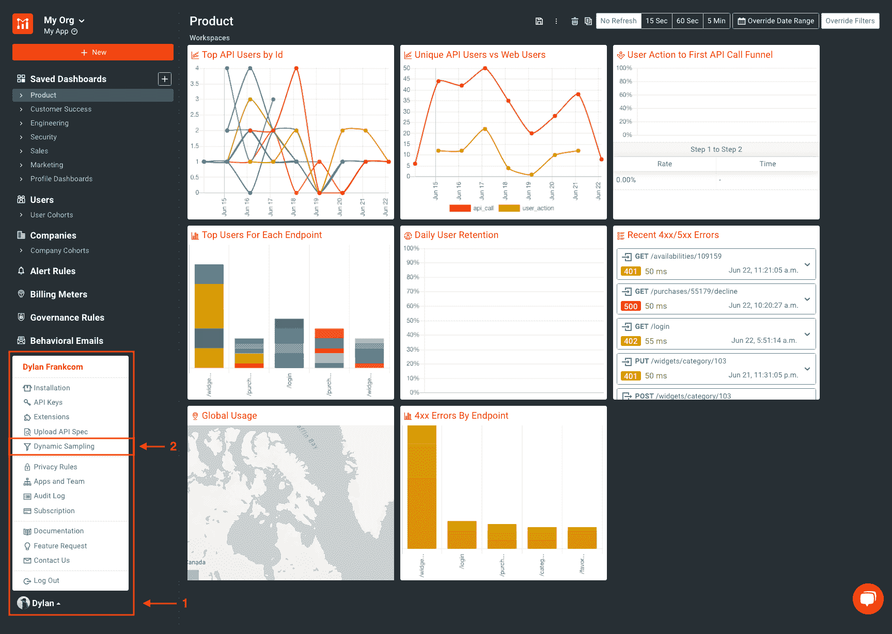
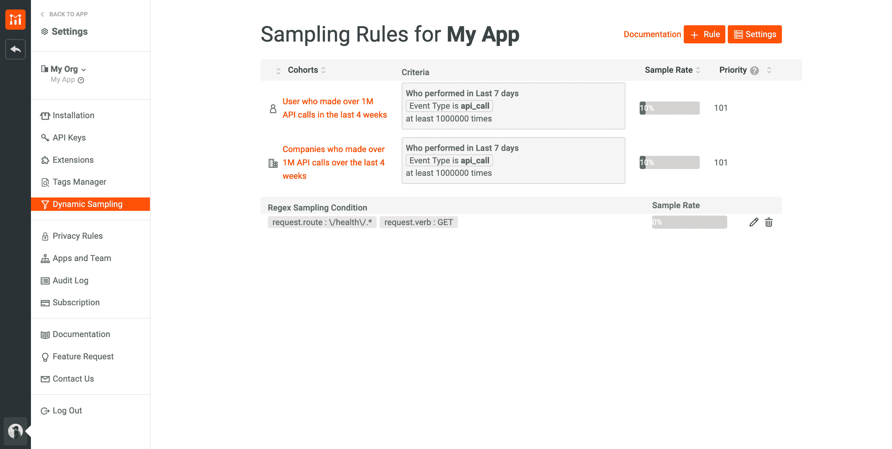
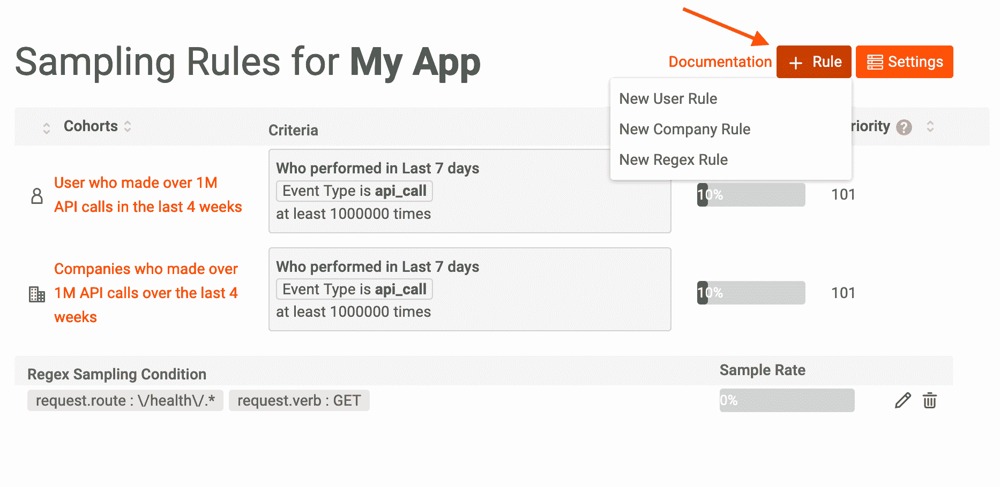
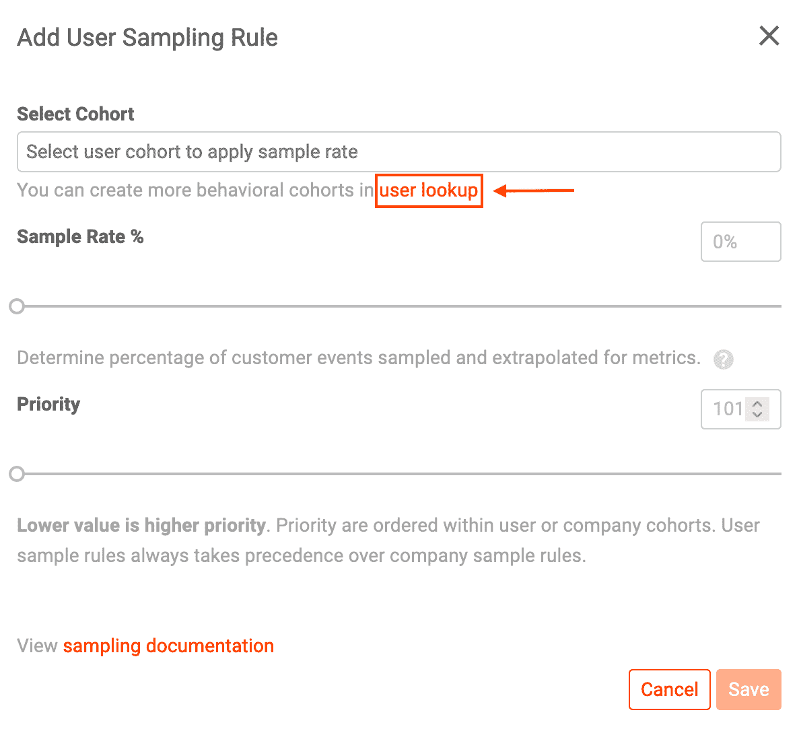
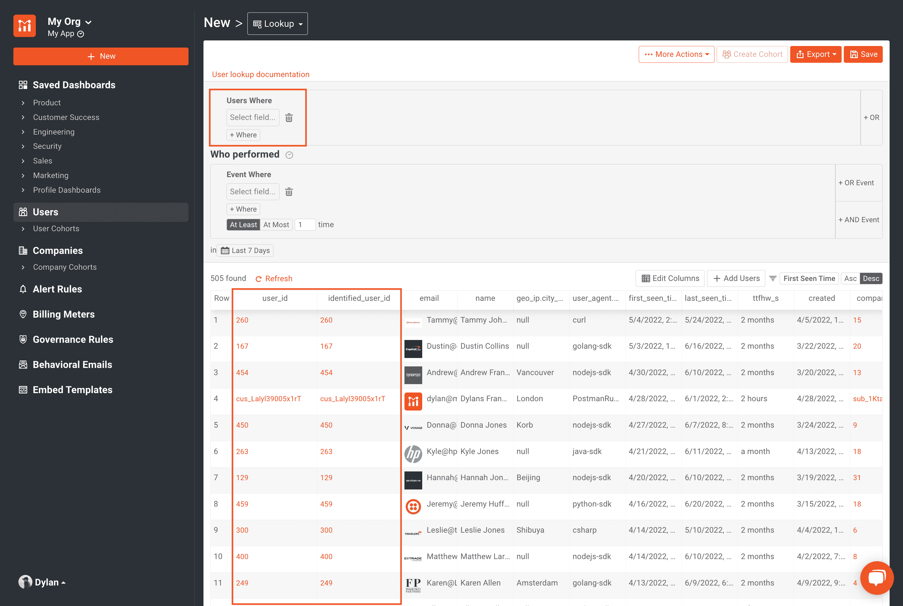
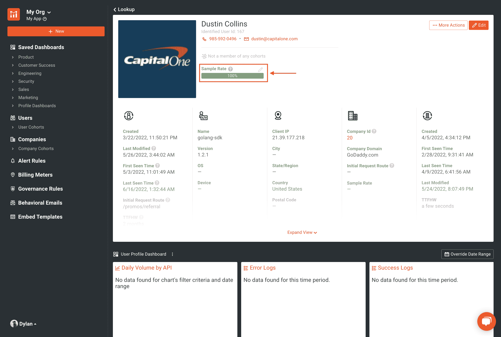
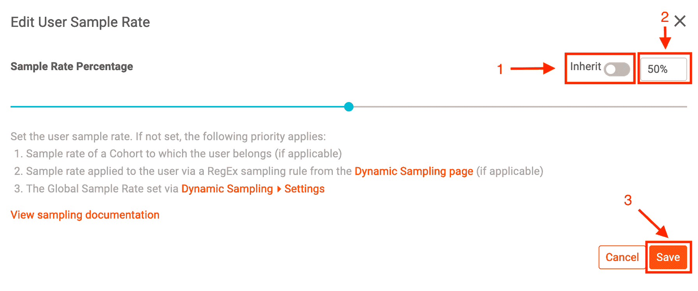
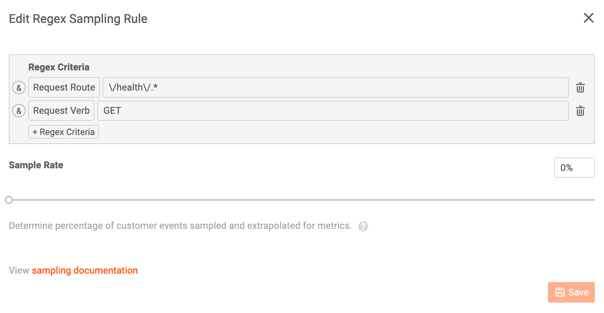
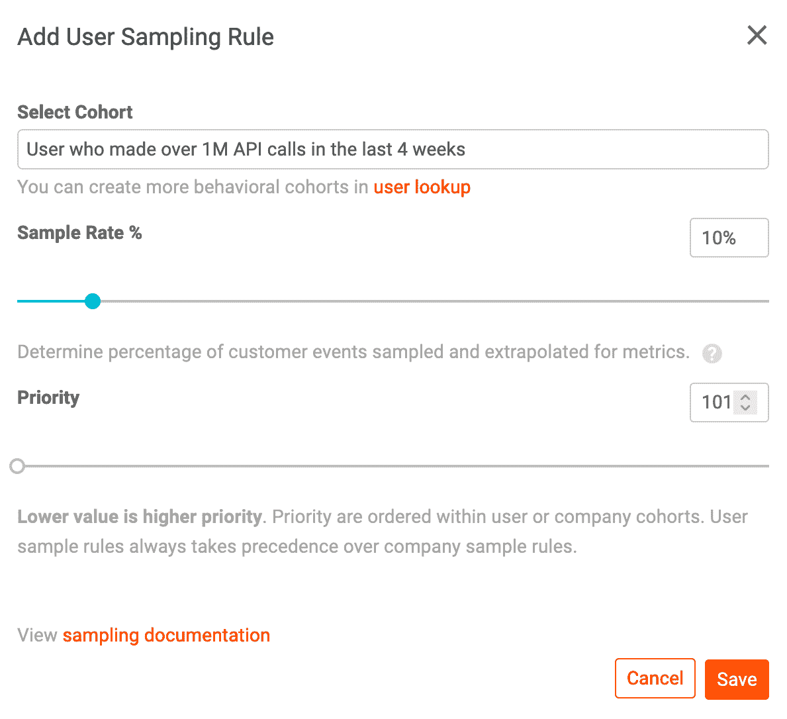
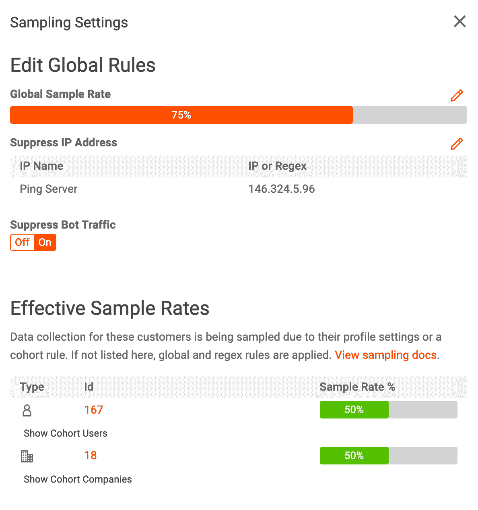

# 什么是动态采样，它是如何工作的

> 原文：<https://www.moesif.com/blog/technical/api-analytics/What-Is-Dynamic-Sampling-And-How-It-Works/>

有时，您可能希望限制进入 Moesif 的分析数据量。这可能是因为您想要排除特定的流量，例如内部或运行状况检查流量，或者您可能想要减少不必要的数据以控制成本。我们的企业计划为客户提供的动态采样正是为此而构建的。动态采样允许您根据客户或 API 行为控制将哪些 API 调用记录到 Moesif。Moesif 智能推断指标，即使在多采样率下也能准确报告。这意味着，无论您设置了什么样的规则或采样速率，您都可以确保您看到的仍然是数据的准确表示。

动态采样通过在 Moesif 仪表板中设置采样规则来控制。您可以根据请求路径、响应状态代码、用户或公司行为等标准创建规则。您还可以控制每个规则应用的采样速率。采样率是事件进入 Moesif 的百分比。例如，如果您设置一个规则，对 50%的事件进行采样，那么 Moesif 将智能地记录一半的匹配事件(而不是每隔一个事件记录一次，以满足 50%的采样率)。

## 为什么使用动态采样

我们的动态采样功能适用于客户的两种使用情形:

*   让用户能够减少 Moesif 中过多或不感兴趣的呼叫，同时保留您从平台中获得的洞察力。
*   允许用户降低其企业订阅成本并节省资金。Moesif 会考虑您创建的采样规则，并智能地推断使用指标。

> 抽样的 API 调用不计入您的配额；例如，如果您的 API 通常每月看到 100 万个 API 调用，但全局采样率被设置为 25%，则只有每月进入 Moesif 的 25 万个事件将计入该配额。

## 何时不使用动态采样

如果您避免对进入 Moesif 的特定事件进行动态采样，那将是最好的。这些用例包括当您利用其他 Moesif 功能时，如[计量计费](https://www.moesif.com/solutions/metered-api-billing?utm_campaign=Int-site&utm_source=blog&utm_medium=blog-cta&utm_term=what-is-dynamic-sampling)或[治理规则](https://www.moesif.com/features/api-governance-rules?utm_campaign=Int-site&utm_source=blog&utm_medium=blog-cta&utm_term=what-is-dynamic-sampling)，您希望在 Moesif 中评估每个呼叫。

对进入 Moesif 的 API 调用数量进行动态采样会影响货币化的 API，因为它无法跟踪确切的使用情况，可能会遗漏一些事件，这取决于所应用的采样率。这将影响您的计费仪表和发送给客户的发票。但是，一种解决方法是对未货币化的端点应用动态采样，并让事件以 100%计入您的计费表样本。

不使用动态采样的另一个原因是，当记录的 API 调用少于订阅计划支持的调用数量时。例如，假设您正在进行的 API 调用比您的订阅计划包括的要少。在这种情况下，动态采样是不必要的，除非您只是试图在 Moesif 中排除不想要的数据，以保持数据的整洁。这方面的示例可能不包括来自运行状况检查探测器或内部测试的流量。

## 四种类型的采样率

动态采样规则分为四种样本集，并按以下方式排列优先级:

*   单个用户或公司的采样速率
*   基于正则表达式规则的采样率
*   基于用户行为和人口统计数据的采样率([保存的群组](https://www.moesif.com/docs/user-analytics/saved-cohorts/?utm_campaign=Int-site&utm_source=blog&utm_medium=blog-cta&utm_term=what-is-dynamic-sampling))
*   全球适用的采样速率

这意味着，如果为特定客户设置了采样率，这将优先于与客户所属的行为群组相关联的采样率。全局采样速率的优先级最低，默认情况下，所有客户的采样速率都设置为 100%。如果一个 API 调用与多个规则匹配，它将由优先级层次结构中的第一种采样率进行处理。

## 如何在 Moesif 中创建动态采样规则

现在您已经了解了什么是动态采样以及它能做什么。我们简单看一下如何设置一些动态采样规则。首先，导航到 Moesif 中的**动态采样**屏幕。

在这里，我们可以访问已经创建的所有采样率。

选择 **+ Rule** 按钮将允许我们创建新的用户或公司、正则表达式或群组采样规则。

### 特定用户或公司

选择**新用户规则**或**新公司规则**后，分别选择**用户查找**或**公司查找**按钮。

> 在本例中，我们将展示用户查找，但公司的流程是一样的。

继续从用户列表中选择一个 **ID** 进入他们的 **[剖面图](https://www.moesif.com/docs/getting-started/users/?utm_campaign=Int-site&utm_source=blog&utm_medium=blog-cta&utm_term=what-is-dynamic-sampling)** 。您可以使用 **Users Where** 过滤器快速找到您要寻找的用户。

在“采样速率”下的“配置文件”视图中，选择铅笔图标以更改特定用户的采样速率。

禁用继承切换以允许调整用户的采样速率。通过手动输入速率或使用滑块设置所需的采样速率，然后选择保存。

### 正则表达式规则

返回到动态采样规则页面，在 **+新**下拉菜单中选择**新正则表达式规则**，输入您想要的标准和采样率并保存。在这个例子中；我们将采样率设置为零，以排除对任何健康端点的所有 *GET* 请求。这些呼叫不会出现在用户界面中，也不会计入我们的活动配额。

### 通过保存的群组获得行为或人口统计数据

> 通过利用[保存的群组](https://www.moesif.com/docs/user-analytics/saved-cohorts?utm_campaign=Int-site&utm_source=blog&utm_medium=blog-cta&utm_term=what-is-dynamic-sampling)完成行为和人口统计采样；如果你对保存的队列不熟悉，请查看我们的[博客文章](https://www.moesif.com/blog/technical/api-analytics/Saved-Cohorts-The-What-Why-And-How?utm_campaign=Int-site&utm_source=blog&utm_medium=blog-cta&utm_term=what-is-dynamic-sampling)、[书面指南](https://www.moesif.com/docs/guides/guide-creating-saved-cohorts?utm_campaign=Int-site&utm_source=blog&utm_medium=blog-cta&utm_term=what-is-dynamic-sampling)或[视频指南](https://youtu.be/gwdV9B1ibOY)以了解更多信息。

设定群组的取样率相当容易。在动态抽样规则页面选择 **+新**按钮，然后选择**新用户规则**或**新公司规则**。将出现一个模式，让您选择一个普遍保存的群组。继续设置所需的采样速率和优先级。优先级在用户或公司群组内排序。用户样本规则始终优先于公司样本规则。

### 全球的

您可以通过点击动态采样规则页面上的**设置**按钮来应用全局规则。出现的结果模式允许您设置全局采样速率，抑制已知的 bot 流量，以及明确或通过 regex 规则阻止来自给定 IP 地址的流量。模态的底部展示了在其各自的用户配置文件中设置了采样速率的所有用户或公司。

## 尝试一下

出于许多原因，动态采样可能是 Moesif 配置的重要组成部分。我们还回顾了一些限制和场景，在这些场景中，动态采样不是最佳选择，比如在对端点应用计费计量或治理规则时。最后，我们讨论了如何在 Moesif 内部建立不同类型的规则。

如果您已经加入了 Moesif 企业计划，那么您可以使用动态抽样。请随意查看我们的深度[书面教程](https://www.moesif.com/docs/guides/dynamic-sampling?utm_campaign=Int-site&utm_source=blog&utm_medium=blog-cta&utm_term=what-is-dynamic-sampling)或[视频指南](https://youtu.be/7Wxo81zw1Hw)。如果您没有企业计划，您可以[联系我们的销售团队](mailto:sales@moesif.com?subject=Dynamic%20sampling)来解锁这一强大的功能。如果您是 Moesif 的新手，[今天就注册](https://www.moesif.com/wrap?onboard=true&utm_campaign=Int-site&utm_source=blog&utm_medium=blog-cta&utm_term=what-is-dynamic-sampling)，开始为您的组织释放 API 分析的力量。