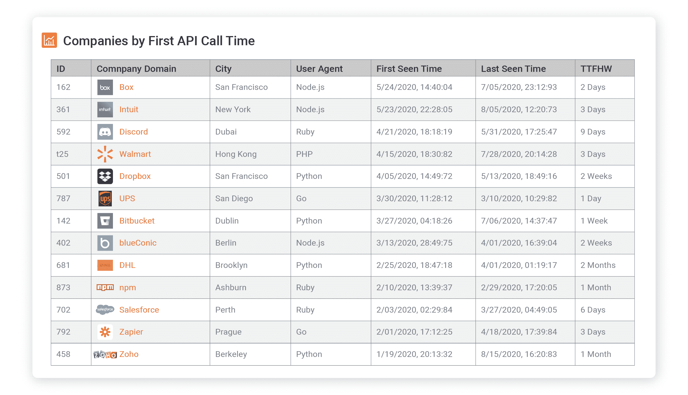

# 什么是开发人员关系，什么是常见角色？

> 原文：<https://www.moesif.com/blog/developer-relations/definition/What-is-Developer-Relations-and-What-are-Common-Roles/>

开发者关系不仅仅是 API 优先公司的一个角色或部门。开发者关系是一种心态，让开发者采用一个平台，让他们的计划成功，而不是试图卖给那些开发者。这使得开发者关系不同于传统的销售和营销角色。然而，如果你问“什么是开发商关系？”，您可能会得到许多模棱两可的回答，因为开发人员关系是各种不同角色和职位的总称。有些头衔包括“开发者倡导者”和“开发者传道者”，但也可以包括其他新的头衔，如“开发者体验经理”。“这些角色因公司而异，甚至在公司的不同团队中也是如此。

这篇文章概述了 devrel 中的一些不同角色，例如:

*   开发者福音传播者
*   开发商代言人
*   开发者体验
*   开发者营销

## 概观

开发者关系的艺术是在你的社区内建立真实的关系，而不是向他们推销或营销。这可以通过面对面、在线或其他方式完成。与开发人员的任何交流通常都属于 devrel 的范畴，需要高超的技术交流技巧，与角色无关。一些开发人员关系角色专注于社区参与和宣传。其他 devrel 角色专注于产品管理和开发者体验。

## 开发者福音传播者

当工程师听到开发人员关系时，就会想到开发人员传道者的角色(也称为技术大使)，因为这是最受关注的角色之一。一个开发者传道者专注于“把话传出去”。这可能意味着在会议上发言、参加聚会和举办黑客马拉松。他们的日程表很快就被承诺排满了，出差的时间可能比在办公室的时间还多。然而，他们也花费大量时间在线创建代码样本、网络研讨会和主持虚拟办公时间。布道者必须有技术头脑，但不一定自己就是工程师。他们大部分时间都在充当公司的品牌大使。

## 开发商代言人

与开发人员布道者不同，开发人员倡导者的目标不是制造轰动，并向全世界介绍你的平台。相反，开发人员倡导者的角色更多的是客户成功和产品之间的融合。他们的目标是让开发人员能够成功地利用您的平台和 API，同时向内部产品团队宣传他们的需求。他们是更大的社区和各种内部产品团队之间的有效纽带。他们可能会收集反馈，创建演示和代码示例，或者找到产品问题和产品缺陷的解决方案。在一些公司，他们可能表现得像“销售工程师”或“解决方案顾问”，通常比布道者更专业。

## 开发者体验

就像移动应用需要好的用户体验一样，好的 API 需要好的开发者体验(DX)。对于开发人员使用的任何东西，一个专门的开发人员体验团队的行为就像事实上的产品所有者一样。他们可能拥有入职流程、SDK/API 设计和文档。在一些公司中，开发人员关系存在于产品组织中，并拥有整个开发人员体验。在其他公司，devrel 可能与市场营销保持一致，导致开发人员体验归另一个团队所有，如产品团队或专门的开发人员体验团队。

## 开发者营销

营销本身通常不包含在 devrel 的保护伞下，但是 devrel 确实与开发者营销紧密合作，保证了它的包含。开发者营销有传统的营销目标，如营销合格的线索(MQLs)和推动收购。然而，对开发者的营销与传统的 B2B 或 B2C 营销有很大不同。如果它围绕着“集客营销”的原则，创造一个吸引人们的品牌，而不是把一个品牌推给开发商。开发者营销几乎总是涉及大量内容联合战略，但也包括付费渠道，如广告词，以及活动赞助。开发商营销可能会赞助一个会议，他们公司的一个拥护者会在会上发言。

## 结束语

Devrel 是一个现有的新领域。如果你是一家 API first 或平台公司，拥有一个 devrel 团队可以帮助你与开发者建立关系，而不会在营销或销售方面显得过于强势。