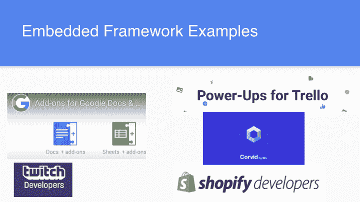
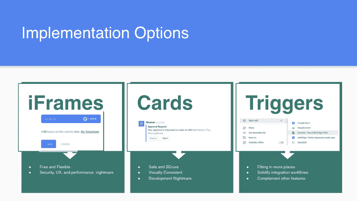
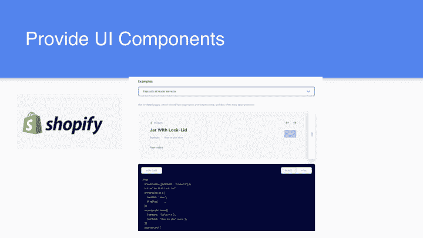
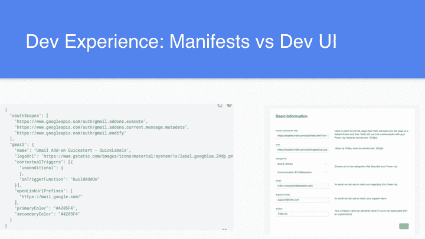

# 开发者平台的下一步是什么:嵌入式集成和 API

> 原文：<https://www.moesif.com/blog/developer-platforms/embedded-frameworks/Whats-Next-For-Developer-Platforms-Embedded-Integrations-And-APIs/>

*这是 Jeremy Glassenberg 在 2020 年 3 月旧金山 [API 和 IPA Meetup](https://www.meetup.com/apiipa/) 上演讲的姊妹篇。他演讲的完整视频在 Moesif 的 [YouTube 频道](https://youtu.be/XhCRkmabQl0)上。*

[https://www.youtube.com/embed/XhCRkmabQl0](https://www.youtube.com/embed/XhCRkmabQl0)

## 介绍

随着流行的 web 服务扩展其开发者平台，让合作伙伴直接集成到它们的界面中，设计趋势正在从嵌入式集成领域的经验中形成。随着 Google Drive 连接 Balsamiq 和 ShiftEdit 等工具，Gmail 在其 web 和移动用户界面中支持 Docusign，以及 Trello 等服务在其自己的界面中提供插件，由第三方提供的定制体验正在证明自己是改进产品和发展业务的一种很好的方式。

让我们看看什么是成功的和不成功的，什么趋势在起作用，以及启动成功的嵌入式集成计划需要哪些 UX 和技术考虑。

## 2008 年开局不利

对嵌入式集成框架的第一次尝试，让第三方的东西出现在你的界面中，变得有点混乱。早期的解决方案包括 iGoogle、OpenSocial，甚至是一家 YC 公司 youOS，它让网页像操作系统一样运行。

回到 2008 - 2010 年，令人困惑的问题仅仅是用例没有被考虑清楚。消费者不一定想让网络像操作系统一样，或者将第三方的内容整合到他们的社交网络个人资料中。没有市场需求。

雪上加霜的是，iGoogle 和其他平台不仅面向开发者，而且当这些产品失败时，它们在消费者面前也失败了。这对企业来说很不利，所以它们被悄悄地关闭了。平台提供商变得畏首畏尾。

## 市场的兴起

随着 web 服务的增长和用户群的扩大，大公司看到了开发人员拼凑解决方案来构建他们想要的特性和服务。确实有一群人试图在 Gmail 之外增强 Gmail。Trello，Shopify，Wix，twitch 和许多其他公司也是如此。

通过与客户群积极互动，这些公司可以确定他们需要什么，并构建真正的用例。他们看着:

*   他们在实验什么
*   他们是如何开始的
*   他们学到了什么

他们只有在拥有足够多的用户基础时才推出平台，他们可以看到他们的产品中缺少一些东西，用户正在要求，并且他们不想自己构建和维护。

成功的嵌入式框架确实遵循市场模型。因为已经有了一个庞大的用户群，所以最重要的是留住客户，而不是采用客户或客户增长。

## 产品和用户体验

实际上，将开发人员平台实现为嵌入式框架有很多选择。突出前三名:

### iFrames

让另一个网站嵌入您的网站。被许多人使用，包括 Intercom 和 Google Docs。

| 赞成的意见 | 骗局 |
| --- | --- |
| 免费开放 | 性能和安全问题 |
| 设置简单 | iFrames 和移动应用程序不能很好地协同工作 |

### 卡片

像物体一样形成。由 Slack 和 Gmail 使用。

| 赞成的意见 | 骗局 |
| --- | --- |
| 移动友好 | 没有标准 |
| 更好的安全性(不允许客户端 javascript) |   |
| 良好的性能 |   |

### 扳机

打开一个新窗口并调用 API。iFrames 使用供应商特定的 API“编程语言”调用客户端 javascript。

## 设计和用户界面

最佳实践要求为开发人员提供一些 UI 组件，以便界面看起来一致。一个很好的例子是 Shopify，他们正在激励和简化开发者的体验；他们只是给出了更多的代码，也就是说，组件的样式就在他们的库中，而不是推出一个特定的 UI；这样就可以更快地编写应用程序，并拥有一致的用户界面。

## DevEx

更进一步，帮助您的开发人员在清单、表格(脸书)或开发门户(Trello)中轻松管理他们的应用。

## 结论

嵌入式框架使第三方能够在您自己的界面中，在您自己的用户体验中深入工作。我们已经介绍了如何超越 API，以及如何理解服务如何与您的产品相联系，并为您的用户创造有意义的体验。

建立框架，让这些第三方应用成为体验的一部分，是留住客户的基础。