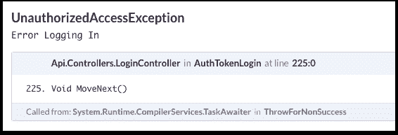

# 为什么我创办了另一家应用程序日志公司

> 原文：<https://www.moesif.com/blog/technical/logging/Why-I-Started-Another-Application-Logging-Company/>

有许多日志记录和异常跟踪公司。从 Sumo Logic 到 Sentry，开发人员在应用程序日志记录和异常跟踪方面有了比以往更多的选择。为什么要在一个似乎有大玩家的领域创建一个新的伐木公司？

## 背景

在创办 Moesif 之前，我是 Trove 公司的首席技术官，在此之前，我是英特尔公司的 CPU 架构师。在每个职位上，调试总是我日常活动的一大部分。在我们的项目生命周期中，我的大部分日常工作都涉及到调试。我会调试客户报告的问题，调试回归测试中出现的错误，在提交之前调试我自己的代码，等等。无法回避的事实是，大多数开发人员花在调试上的时间比花在编码和产品开发上的时间要多。

对于 [Trove 栈](https://stackshare.io/dgilling/trove-market)，我们使用 Loggly 来存储来自后端 API 驱动服务的应用程序日志。这些是 Scala、C#和 NodeJS 服务的组合。对于我们的 web 应用程序，我们还使用 Sentry 来记录和跟踪异常。对于我们的移动应用，我们使用了 Crashlytics。

我们还使用 New Relic 进行了一些性能监控，尽管 New Relic 主要对操作和性能人员有用，但对应用程序调试没有用。

然而，即使有了所有这些服务，调试仍然是一个手动和缓慢的过程。在自动驾驶汽车的时代，为什么我们不能让调试更加自动化？

## 分解调试过程

### 收集上下文

在 Trove，我收到了一些客户支持请求，客户在登录时会遇到错误。

要开始调试，我必须收集客户上下文，比如错误发生在什么设备上以及错误发生的时间。我通过从支持票据中搜索客户的电子邮件，在我们的用户数据库中查找了 *user_id* 。

在得到一个*用户标识*后，我进行了日志搜索，希望这个*用户标识*被记录为异常。

唉，我发现错误了！但问题是 Loggly 和 Sentry 中记录的异常非常普通:



### 缩小失败服务的范围

我们有相当多的微服务支持我们的后端利用工具，如 Docker。有些是 Node，有些是 Scala，等等。然后我们有了移动和网络应用。Loggly 中的错误只会告诉我错误发生在哪里。然而，我们都知道，通常错误是一些因果关系的结果，但原因可能是错误发生的上游。

为了缩小根本原因的范围，我继续进行我的*手动*日志搜索，寻找相关消息，试图追溯到源头。对于这个特殊的登录错误，我能够追溯到第三方 API，Google 认证 API。

### 消除过程

即使我们看到记录的错误，现在知道这是由于谷歌 API，它仍然是非常短暂的。即使在尝试完成谷歌登录步骤时，我自己也无法重现错误。

我开始收集更多的信息。

*   错误是否只发生在特定的数据中心？
*   它是通过 Google 登录 API 的特定参数发生的吗？
*   第一个出现这个错误的版本是什么？

对于任何开发人员来说，做这个排除过程的时间会非常长，是一种时间浪费。


### 结果呢

我们最终找到了导致错误的根源，在这种情况下，由于短暂的 HTTP 超时，移动客户端会调用 Google Auth API 以获得一次性使用授权代码(OTU)。这个 OTU 令牌被传递给我们自己的 API，然后它调用另一个 Google API 来验证授权代码，并交换一个访问和刷新令牌。由于授权码已被使用或过期，该最终端点将出错。

我们必须追溯到被调用两次的初始 auth 端点。谷歌将返回相同的 OTU 代码(可能是由于缓存)。

API 调用流程:

```py
-> accounts.google.com/o/oauth2/v2/auth
  -> api.usetrove.com/login
    -> www.googleapis.com/oauth2/v4/token 
```

## 这种做法有什么问题？

### 1.顾客必须告诉我

即使有始终连接的警报(Slack、PagerDuty、DataDog 等)，我仍然有客户告诉我有问题。为什么我们的测试没有发现这个？为什么 Sentry 或 Loggly 没有在客户之前提醒我这些问题？

**一个提示:**状态空间爆炸和 bug 的动态本质。

#### 错误表现为特定的:

*   系统的状态
*   系统的输入(包括计时)

如果我可以精确地重新创建状态和输入，那么我就可以重新创建任何 bug。问题是现代网络应用的状态比几年前复杂了几个数量级。

国家分散在:

*   许多不同的 Pb 大小的数据存储
*   许多不同类型的设备和客户端也存储状态
*   构建工件和代码版本的状态
*   配置和环境状态
*   操作系统/虚拟机/容器状态

输入现在分散在数百个容器中，并且必须考虑网络延迟输入、用户对设备的输入等。

警报仍然是静态的(即，如果错误率在下一分钟翻倍，我必须设置警报来提醒我)。测试也是静态的。测试是人为设计的场景，很多时候是由开发人员编写的，他们也对特性进行编码。如果该特性由于跨服务交互的架构假设而存在缺陷，该怎么办？这些假设也可能被纳入测试，造成错误的通过。

### 2.日志搜索仍然非常手动

一旦我在日志记录或异常跟踪软件中发现错误，我仍然需要自己进行日志搜索。

从调试登录问题可以看出，从支持电子邮件中查找 *user_id* 需要时间。然后我必须找到该用户发生的异常。

调试就像尝试一堆小实验。您根据当前对错误场景的了解提出一个假设，然后研究日志，看它是否验证了您的假设。

你需要一遍又一遍地重复这一点，直到你有足够的证据断定根本原因是。

这个过程听起来不像是计算机能做得更快的事情吗？

### 3.日志必须手动编码

大多数开发人员会记录每个异常，或者至少记录他们认为的错误。如果您需要追溯到导致错误的服务，而消息没有被记录，该怎么办？就像人工测试一样，开发人员只能记录他们认为调试服务需要的东西。如果一个新的 bug 以不同于预期的方式强调服务，并且没有记录足够的上下文，该怎么办？

您必须添加更多的日志消息，然后看看是否可以重新创建该场景。发布一个包含更多信息的新版本来捕捉问题需要时间。

### 4.日志不能显示交互

大多数日志和异常跟踪工具将消息本身显示为问题单，或者类似于跟踪日志流。如果错误是跨多个服务的呢？如何用简洁的方式表现这一点？当您开始研究与跨多个系统的并发性相关的更复杂的错误时，仍然很难仅使用日志来查找根本原因。

## 结论

调试可能是有趣和令人兴奋的，尤其是有时当我发现一个疯狂的竞争条件时，这很有趣。然而，大多数公司不会因为“好玩”而付钱给开发者。花在调试上的时间不是花在产品开发或增长上的时间，这可能会影响收入和底线。

 **moes if 如何让调试变得更简单？**

[了解更多](https://www.moesif.com?utm_source=blog)