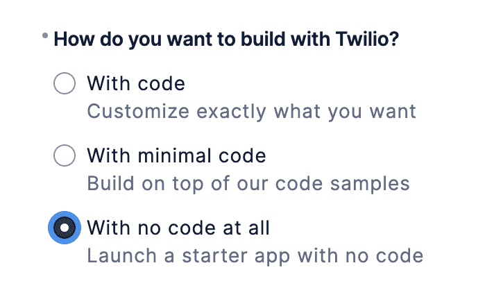
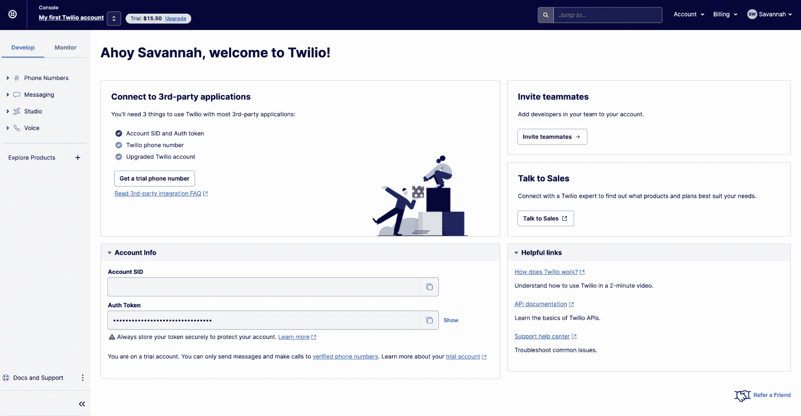
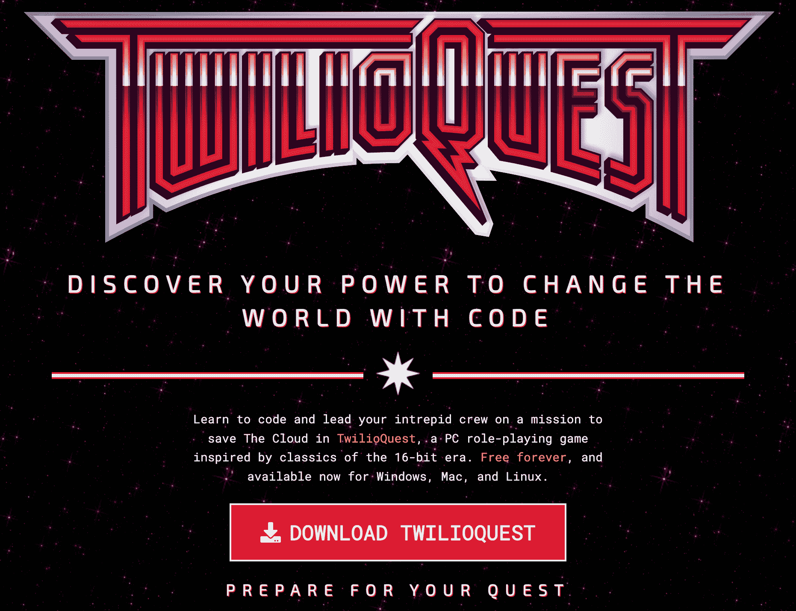
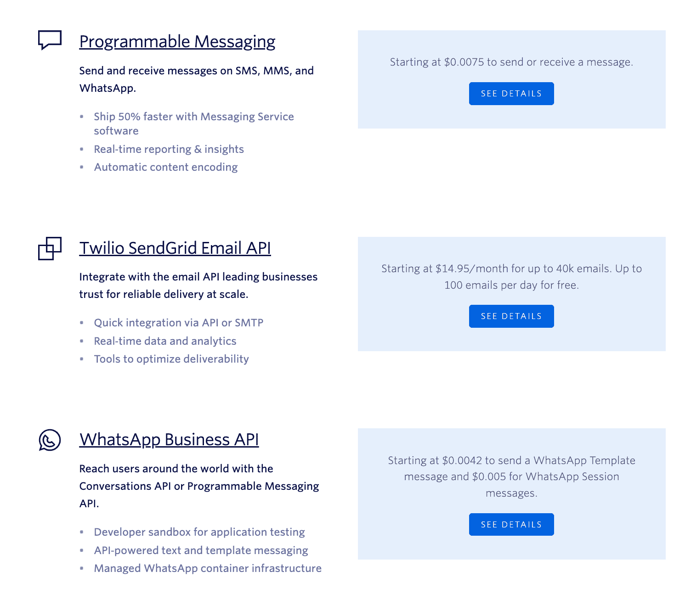
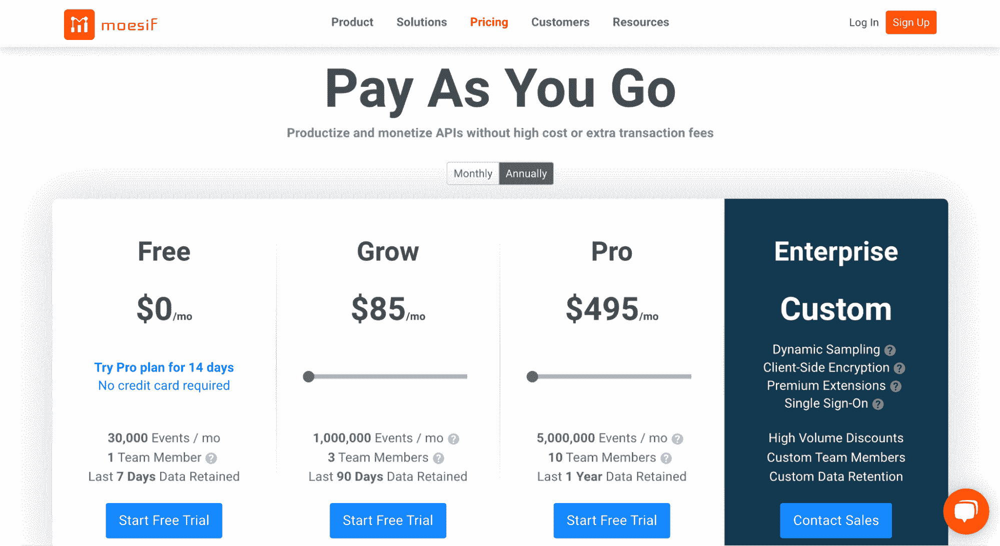
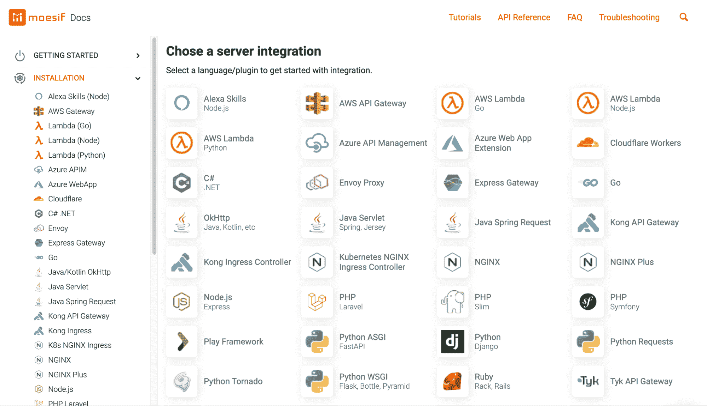

# 为什么 Twilio 客户不会去任何地方

> 原文：<https://www.moesif.com/blog/best-practices/api-product-management/Why-Twilio-Customers-Are-Not-Going-Anywhere/>

众所周知:我们是像 Twilio 这样的 API first 公司的粉丝。超过 1000 万客户使用他们的平台，看来我们并不孤单。

长期以来，Twilio 一直是开发人员的宠儿，它平易近人的平台使得在几乎任何环境下发送语音、视频和 SMS 消息都很容易。

今天，我们将深入了解 Twilio 如何在客户参与方面提供最佳服务。

## 低代码/无代码功能

“建造还是购买”，这是个问题。就像经典的莎士比亚难题，“生存还是毁灭”，必须做出选择。对于 SaaS 公司来说，增加新功能的成本曾经意味着在内部构建这些功能，或者向外部供应商支付额外的功能。这两种选择都带来了严峻的挑战。

现在有了第三种选择。低代码/无代码(LC/NC)工具提供了额外的功能，无需编写复杂的代码。使用 LC/NC 工具，通常需要几个月才能构建的软件可以在几周内发布。自然，选项[已经越来越受欢迎](https://kissflow.com/low-code/gartner-forecasts-low-code-development-market-to-grow-23-in-2021/)。

Twilio 没有错过这一趋势，他于 2017 年底推出了 Twilio Studio。Twilio Studio 让客户无需编写代码即可享受强大的通信基础设施。这对于非技术用户，以及希望快速构建的精益工程团队来说非常好。

## 简化的用户界面

Twilio 的界面既方便又易于控制。开发者和产品经理都不需要担心决策疲劳。像宾利一样，Twilio 驾驶起来很平稳，同时在引擎盖下提供了大量动力。

仅在 onboarding 中，就很容易看出是什么让 Twilio 的界面如此出色。

## 设定期望

从一开始，Twilio 就让用户知道会发生什么。预计到有人可能会问，“Twilio 是多少钱”，Twilio 立即让用户知道**没有预付到期**。

这是对他们在平台的每个方面提供的透明度的一个温和的介绍。Twilio 也很快让用户知道他们可以用他们的产品做什么。请参见他们早期入职流程中的以下元素作为解释。

在入职的最初几分钟，你就已经知道 Twilio 不打算给你惊喜。在平台的更深处，他们继续以同样的方式呈现新的信息。

### 少即是多

> “完美的实现，不是当没有更多可以添加的时候，而是当没有什么可以拿走的时候。”-安托万·德圣埃克苏佩里

如果用一个词来形容 Twilio 的界面，那就是“精确”整洁的菜单、恰当的工具提示和强烈的视觉设计创造了一个干净的用户界面。

呈现给用户的每一个选择都被有意简化，而不失去意义。一旦用户完成了上述步骤，他们就会提供有针对性的问题来定制用户的新帐户。措辞直接、明确、平易近人。同时，呈现给用户的选择数量提供了没有压倒性的定制。

在这几个步骤之后，初始入职就完成了。从这里，用户第一次被引导到他们的仪表板。

用户可以立即体验 Twilio 的全部功能。免费用户有机会设置一个 Twilio 电话号码，添加队友，并尝试使用 Twilio Studio 进行 LC/NC 体验。

## 多样化的帮助资源

同时，可访问的支持资源确保任何需要详细信息的人都能找到它们。这些资源可以通过多个周到的链接获得，确保所有用户都能获得他们需要的信息。

用户可以选择通过帮助文章、文档、导游，甚至游戏 Twilio Quest 来了解 Twilio。

总的来说，Twilio 的界面提供了它所需要的一切，而没有损害用户体验。

## 他们是第一批“开发者优先”的人

在 Twilio 成为上市后独角兽公司之前，他们并不以像典型的 SaaS 企业那样销售而闻名。他们经常根本不“卖”。然而，它们仍然在增长。

创始人杰夫·劳森的一个著名故事完美地说明了这一点。

在劳森和两个朋友于 2008 年创立 Twilio 大约一年后，劳森受邀在一个名为“旧金山新技术聚会”的流行社交聚会上介绍它。劳森决定让 Twilio 软件自己说话，而不是谈论一种本质上难以解释的技术。在 1000 人面前，劳森开始讲述他的故事，同时编写了一个 Twilio 应用程序——一个简单的会议线路。

仅仅几分钟后，他就开了一个账户，获得了一个电话号码，在写了几行房间里每个人都能理解的代码后，他的会议线路就开通了。劳森然后要求每个人都打电话进来，就这样一群开发人员开了一个大型电话会议。劳森随后添加了一些代码，他的应用程序给每个人打了电话，感谢他们的参与。随着整个房间的电话开始嗡嗡作响，人群狂热起来。”–[米格尔·赫尔夫特，福布斯](https://www.forbes.com/sites/miguelhelft/2016/09/14/the-wizard-of-apps-how-jeff-lawson-turned-twilio-into-the-mightiest-unicorn)

## 买之前先试试

Twilio 为开发人员提供了尝试他们产品的机会，而不期望购买。虽然与当时占主导地位的企业销售模式相反，但跳过前期成本赢得了开发人员社区的信任。很快，Twilio 就赢得了任何项目都可以使用的工具的声誉。

Twilio 不仅仅将开发者视为潜在客户，他们将开发者视为一个社区。有些人甚至认为 Twilio 推广了[开发者福音](https://blog.hubspot.com/website/developer-evangelist#:~:text=What%20Is%20a%20Developer%20Evangelist,software%20needed%20to%20be%20successful)。虽然他们的支付模式只是他们的开发者主导战略的一部分，但它仍然使他们的产品变得伟大。

任何创建 Twilio 账户的免费用户都会发现一套强大的功能。免费试用用户有权获得一个 Twilio 电话号码，允许他们尝试语音通话、视频会议和短信功能。因此，即使 Twilio 的免费功能也提供了他们付费计划的现实预览。

## 灵活的定价选项

如果用户决定超过他们的 15.50 美元的试算表，提供免费注册，他们的账单无缝扩展到 PAYG 定价。要了解更多关于 PAYG 模式的信息，请看我们的另一篇文章。

当新用户想成为客户时，他们会找到适合任何情况的计划选项。这对于几乎任何类型的用户来说都是非常好的，无论他们是想实验性地构建项目，为了好玩，还是为了重要的基础设施。几乎可以适应任何用例。

## 我们为什么喜欢 Twilio

如果说在软件世界中有什么是不变的，那就是变化。作为一个把未来寄托在我们的信念上的公司，每个公司都将成为 API 公司，我们期待看到其他 API 第一的公司成长。

Twilio 继续适应 SaaS 不断变化的现实——它以适应迎接每一个新的挑战。我们渴望在 Moesif 获得类似的弹性，这就是我们提供透明定价功能和简化入职流程的原因。

> Moesif 提供四个计划层级，每个层级都有灵活的 PAYG 计费

我们的定价模式结合了按需付费的灵活性和订阅的可靠性。用户可以使用我们的[四个价格等级](https://www.moesif.com/price?utm_campaign=Int-site&utm_source=blog&utm_medium=body-cta&utm_content=twilio-tear-down)中的一个来衡量他们每月的使用情况。但是，如果他们使用我们服务远少于或多于预期，那么他们每月的账单将反映实际的使用情况。

与 Twilio 类似，我们也致力于简化入职流程。对于大多数安装，Moesif 只需要几行代码来添加我们的 SDK。每个入职工作流都可以根据用户现有的技术体系轻松定制。像 Twilio 一样，我们的平台旨在通过提供有针对性的信息来减少决策疲劳。

像 Twilio 一样，我们也提供“先试后买”的模式。这样，Moesif 用户可以在做出决定之前体验我们产品的全部功能。任何人都可以通过在这里注册免费试用成为用户。

总的来说，我们有充分的理由认为 Twilio 是客户参与方面的“领导者”。它干净的用户体验、对开发者社区的承诺以及创新的速度无疑使它成为通信基础设施的绝佳选择。换句话说，这一千万顾客不会很快离开！