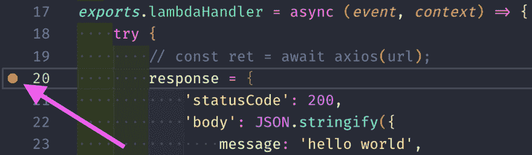
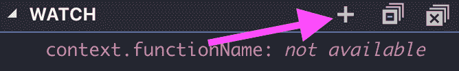
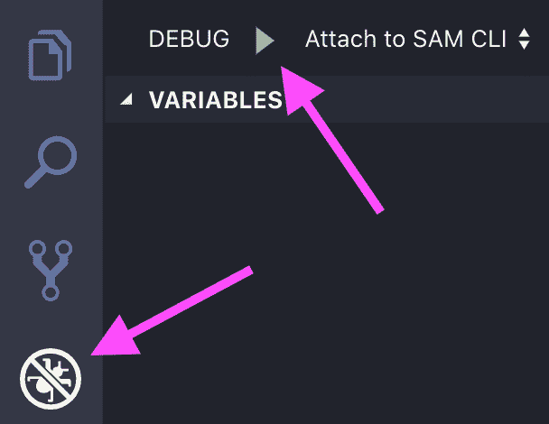
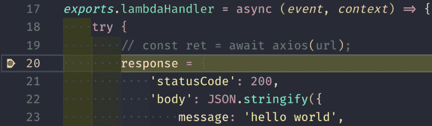
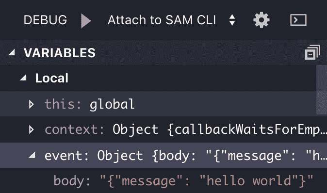

# 使用 SAM CLI 和 VSCode 在本地调试无服务器 AWS Lambda 功能

> 原文：<https://www.moesif.com/blog/technical/serverless/debug-lambda-functions-locally-with-the-sam-cli-and-vscode/>

## 为什么

当我们构建软件时，快速的开发周期总是好的。这种设置对于无服务器开发来说可能有点困难，因为运行我们功能的平台在云中，上传测试并不是我所说的快速。

幸运的是，大多数云提供商为我们提供了减轻这种痛苦的工具，例如，Amazon Web Services 的 SAM CLI。它是一个命令行工具，帮助创建基于 SAM 的应用程序。

在本文中，我们将学习如何使用 SAM CLI 为我们的无服务器应用程序设置本地调试环境。

## 什么

我们需要下列软件。

SAM CLI 是一个用 Python 编写的命令行工具，可以帮助创建和维护无服务器后端。它使用 [AWS SAM](https://github.com/awslabs/serverless-application-model) ，一种 [AWS CloudFormation](https://aws.amazon.com/cloudformation/) 的方言，专门用于处理 AWS Lambda、API-Gateway 和 DynamoDB 等无服务器资源。

[AWS CLI](https://docs.aws.amazon.com/cli/latest/userguide/cli-chap-install.html) 用于通过 CLI 访问 AWS；SAM CLI 在后台使用它来修改 AWS 帐户中的资源。

Docker 让我们执行操作系统级别的虚拟化。有了这项技术，我们可以在 Docker 容器中建立一个环境，并在 Docker 本身可以运行的地方运行这个容器。SAM CLI 使用这项技术在我们的机器上模拟 AWS Lambda 进程的云环境。

[VSCode](https://code.visualstudio.com/) 是一个基于电子的代码编辑器，用 TypeScript 编写。它带有一个内置的调试 UI，我们将利用它来调试我们的无服务器 JavaScript 代码。

## 怎么

我们必须安装 AWS CLI、AWS SAM CLI 和 docker Docker。然后，我们必须创建一个新的 SAM 项目，并将 VSCode 调试 UI 链接到 SAM CLI 为我们启动的 Docker 容器。

### 设置

首先，我们必须安装 AWS CLI，因为 SAM CLI 建立在它的基础上。

```py
$ curl "https://s3.amazonaws.com/aws-cli/awscli-bundle.zip" -o "awscli-bundle.zip"
$ unzip awscli-bundle.zip
$ ./awscli-bundle/install -b ~/bin/aws 
```

AWS CLI 也需要用我们的 AWS 凭证进行配置。

```py
$ aws configure 
```

该命令将询问我们的 IAM 用户凭据。如果你没有 IAM 用户，AWS 为你提供了教程

我们需要安装 Docker、AWS CLI 和 SAM CLI，我将展示一个在 macOS 上安装的示例。

有一个用于 macOS 安装的`dmg`档案，我们可以在这里下载

要在 macOS 上安装 SAM CLI，我们需要自制软件。我们可以用下面的命令安装它:

```py
$ /usr/bin/ruby -e "$(curl -fsSL https://raw.githubusercontent.com/Homebrew/install/master/install)" 
```

然后我们点击 AWS tap，访问 AWS brew 包并安装`aws-sam-cli`包。此下载可能需要几分钟时间。

```py
$ brew tap aws/tap
$ brew install aws-sam-cli 
```

下一步是用`nodejs8.10`运行时初始化一个 SAM 项目。如果我们不使用`--location`命令行参数，SAM CLI 将下载一个 *hello world* 模板并为其创建一个`sam-app`目录。

```py
$ sam init --runtime nodejs8.10
$ cd sam-app 
```

创建的关键文件是保存 AWS Lambda 函数处理程序代码的`hello-world/app.js`和保存示例事件的`event.json`。

为了测试这个示例项目仅有的功能，我们可以使用`sam local invoke`命令:

```py
$ sam local invoke HelloWorldFunction -e event.json 
```

该命令将在`hello-world/app.js`中运行我们的`HelloWorldFunction`函数代码，将`event.json`的内容传递给它，并在最后给出以下输出:

```py
{"statusCode":200,"body":"{\"message\":\"hello world\"}"} 
```

现在 SAM CLI 已经启动并运行，我们已经设置好了项目，我们必须将调试器链接到它。

### 链接调试用户界面

我这里就用 VSCode 内置的调试 UI。

首先，我们必须在要调试的文件中设置一个断点。在我们的例子中，这是`hello-world/app.json`。



我们还可以添加观看表情。该表达式有助于立即从深度嵌套的对象中获取值，而无需在侧面的*变量*选项卡中导航到它们。



接下来，我们必须在本地调用该函数，但是使用不同的 CLI 参数。

`sam local invoke`命令带一个`-d`参数来配置调试端口。如果我们使用它，SAM CLI 将等待调试器连接到该端口，然后才开始运行我们的代码。

如果我们像这样运行命令:

```py
$ sam local invoke -d 9999 -e event.json HelloWorldFunction 
```

我们将得到一个输出，告诉我们调试器正在侦听:

```py
Debugger listening on ws://0.0.0.0:9999/a47891d0-d0d3-419e-8123-caf8baf4fbbc 
```

现在我们有了一个等待调试的过程，我们可以将我们的 VSCode debug-UI 附加到它上面。

为此，我们必须创建一个启动配置。

启动配置特定于 VSCode。我们必须在`.vscode/launch.json`将它们写入一个新文件。

对于我们的应用程序，它可能是这样的:

```py
{  "version":  "0.2.0",  "configurations":  [  {  "name":  "Attach to SAM CLI",  "type":  "node",  "request":  "attach",  "address":  "localhost",  "port":  9999,  "localRoot":  "${workspaceRoot}/hello-world",  "remoteRoot":  "/var/task",  "protocol":  "inspector",  "stopOnEntry":  false  }  ]  } 
```

这里最重要的部分是`port`、`type`、`localRoot`和`protocol`。

我们使用`-d 9999`运行了 SAM CLI，因此需要在启动配置中相应地设置我们的端口。我们还想使用 inspector 协议调试一个 JavaScript/Node.js 文件，该文件位于我们项目的`hello-world`目录中。

如果我们的`sam local invoke`命令仍然在运行并监听调试客户机，我们现在可以在 VSCode 的 debug-UI 中运行我们的启动配置。



如果我们单击“run”按钮，VSCode 应该会将其自身附加到 SAM CLI 进程，这由 VSCode 底部的红色信息栏来指示。

VSCode 突出显示了断点所在的行。



VSCode 中的调试器侧栏应该显示当前作用域的变量，如`event`和`context`。



## 额外奖励:NPM 剧本

为了简化整个过程，我们还可以使用 NPM 脚本来运行 SAM CLI 命令。

为此，我们需要在项目目录中初始化一个 NPM 项目。

```py
$ npm init -y 
```

然后打开新的`package.json`并在`scripts`部分添加一行。

```py
"scripts": {
  "hello-world": "sam local invoke -d 9999 HelloWorldFunction -e "
}, 
```

该脚本在调试模式下运行 SAM CLI，并需要一个指向 JSON 事件文件的路径。

所以我们可以从这里开始:

```py
$ sam local invoke -d 9999 HelloWorldFunction -e event.json 
```

要简洁得多:

```py
$ npm run hello-world -- event.json 
```

`--`确保下面的`event.json`参数被传递给 SAM CLI，而不是 NPM。

## 结论

SAM CLI 工具使 Lambda 函数的调试和测试变得简单。它通过一个标准的调试协议集成了所有流行的 ide 和 debug-ui，所以我们可以使用我们喜欢的工具。

它在后台使用 Docker 的事实减轻了我们设置测试和调试环境带来的巨大负担，并确保我们最终得到类似于云的东西，我们的功能最终将在云中运行。